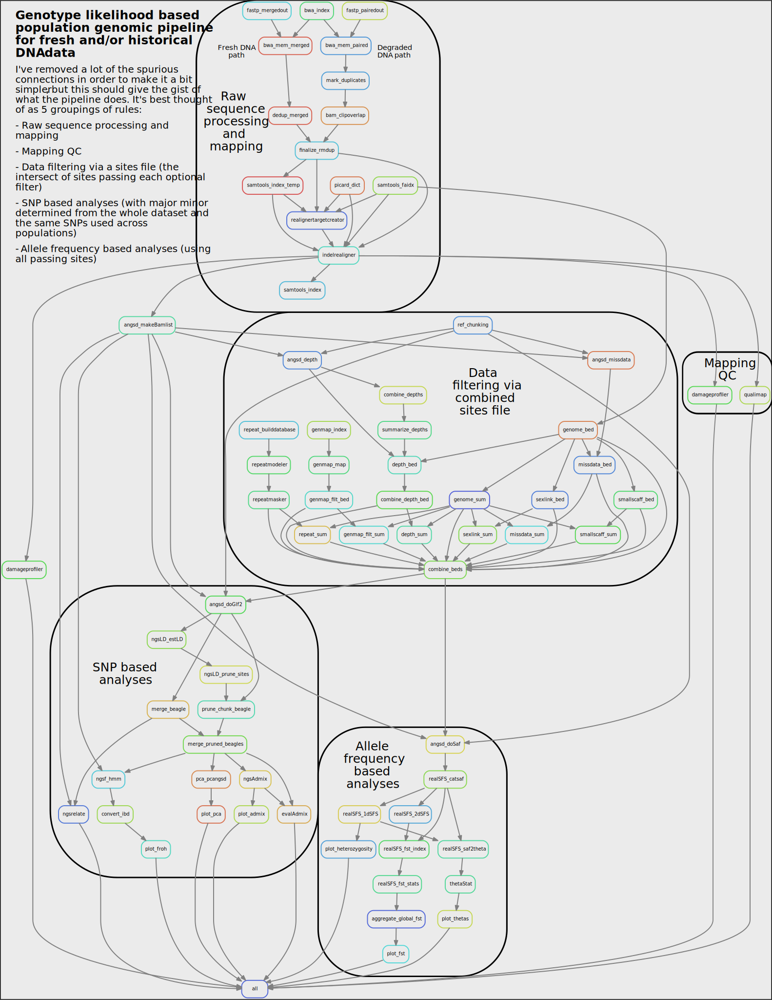

# Genotype likelihood population genomics pipeline

**Under development** - This is under active development, so changes are 
rather rapid. The master branch will have stable versions, and as soon as I 
feel things are complete enough, I'll begin organizing things into proper 
releases.

This pipeline performs multiple common population genomic analyses within a 
genotype likelihood framework primarily using ANGSD and related softwares. It 
requires sequencing reads and a reference genome. Right now, it only works 
with libraries with a single sequencing run of paired end reads per sample, 
but this will be improved down the line. The resource allocaition is tuned 
to Uppmax's Rackham cluster in Sweden. It may need some tuning of the 
resources to work on your cluster.

## Features

Currently, the pipeline performs the following tasks:

### Reference genome preparation

- Indexing of reference for subsequent analyses

### Raw read preparation

- Trimming of paired-end reads from high quality libraries
- Collapsing of paired-end reads from fragmented (aDNA/historical DNA) 
  libraries

### Read mapping

- Mapping prepared raw reads to reference using bwa-mem and clipping of 
  overlapping reads
  - **NOTE**: Reads marked as historical will only map reads that overlap and 
    collapse, to reduce mapping of likely contaminants.
- Removal of PCR and sequencing duplicates separately for fresh 
  (Picard) and fragmented (DeDup) DNA reads
- Realignment around indels
- Optional recalibration of base quality scores on degraded DNA bam files with 
  [MapDamage2](https://ginolhac.github.io/mapDamage/)
- Indexing of deduplicated, realigned, mapped, and recalibrated reads

### Sample quality control

- Assess post-mortem DNA damage with DamageProfiler
- Assess mapping quality stats with Qualimap
- Assess endogenous content before duplicate reads are removed
- Assess sample duplication and relatedness using methods from [Waples et al. 
  2019](https://doi.org/10.1111/mec.14954)

### Data quality filtering

- Analyses can be set with minimum mapping and base quality thresholds
- Exclusion of entire scaffolds (i.e. sex-linked, low quality) through user 
  config (both list and size based)
- Exclusion of repeat regions from analyses using RepeatModeler/RepeatMasker
- Exclusion of low mappability regions with GenMap
- Exclusion of sites with extreme global depth values (determined separately 
  for the entire dataset, and subsets at certain coverage ranges, then merged)
- Exclusion of sites based on data missingness across dataset and/or per 
  population

### GL based population genomic analyses

To speed up the pipeline, many of these analyses are done for part of the 
genome at a time, then later merged. This is only done for analyses where 
possible and where the time saved is appreciable. These chunks are made to be 
a user configured size to allow tuning of run-times (i.e. more jobs, shorter 
runtimes vs fewer jobs, longer runtimes).

SAF based analyses are done on variable and non-variable sites passing quality 
filters. This set is the same across all populations in the dataset and is 
based on the positions passing all the requested filters. Beagle (SNP) based 
analyses are done on a SNP set that is constant across all populations, 
determined from the output of the Beagle file for the whole dataset. When 
relevant, pruned SNPs are used. Pruning is done on the whole dataset beagle 
file and the same pruned sites are used for all populations.

Additionally, all analyses can be repeated with samples subsampled to a lower 
user configured depth. This helps to ensure results are not simply due to 
variance in depth between groups.

**Analyses:**
- Linkage pruning where relevant with ngsLD
- PCA with PCAngsd
- Admixture with NGSAdmix
- 1D and 2D Site frequency spectrum production with ANGSD
- Neutrality statistics per population (Watterson's theta, pairwise pi, 
  Tajima's D) in user defined sliding windows with ANGSD
- Estimation of heterozygosity per sample from 1D SFS with ANGSD
- Pairwise Fst between all populations with ANGSD
- Inbreeding coefficients and runs of homozygosity per sample with ngsF-HMM 
  (**NOTE** This is currently only possible for samples that are within a 
  population sampling, not for lone samples which will always return an 
  inbreeding coefficient of 0)

### Planned

Some additional components to the pipeline are planned, the order below 
roughly corresponding to priority:

**Data analysis**
- Allow custom site list - either as a supplement to the filters already 
  present or as the only filter (by setting all other filters to `false`)
- Sliding window based Fst, and manhattan plots in report for sliding window 
  results
- Allow starting with bam files - for those that want to process raw reads 
  in their own way before performing analyses
- Add calculation of bootstrapped SFS
- Add calculation of Dxy (either Peñalba's or Marques's method, looking at 
  others' methods as well)
- Add schema for configuration files to improve incorrect format handling and 
  to enable defaults
- The pruning script here has been improved and added to ngsLD, make it use 
  that directly rather than the one here
- TreeMix using Maf file outputs?
- Add options to include genotype calling based approaches for comparison?

## Installation

### Requirements

General:
- conda/mamba
- singularity

For processing using a cluster's job queue:
- Appropriate [Snakemake profile for job scheduler](https://github.com/Snakemake-Profiles)

If your cluster uses SLURM as its job scheduler, a slurm profile is packaged 
with this pipeline in the [`slurm`](slurm) folder. (Source: 
[Snakemake-Profiles/slurm](https://github.com/Snakemake-Profiles/slurm))

### Setup

#### 1. Clone this repository

For the current master branch:
```
clone https://github.com/zjnolen/angsd-snakemake-pipeline.git
```

#### 2. Install the necessary conda environment

```bash
# If you have conda installed:
conda env create -f environment.yaml

# If you have mamba installed (faster):
mamba env create -f environment.yaml
```

## Running

For details on the use of snakemake and its options, please see the 
documentation available [here](https://snakemake.readthedocs.io/en/stable/).

### Configuration

The first set is to configure the pipeline for your data. See the 
[configuration readme](config/README.md) for more details on how to do this.

### Running the pipeline

Activate the conda environment you created:

```bash

```

Snakemake runs continuously as the pipeline runs, so it is best to run it in 
a way that will not quit upon user logout. I recommend using [screen](https://linuxize.com/post/how-to-use-linux-screen/), 
which is often installed on many HPCs.

```bash
# start a new screen session
screen -S snakemake

# You will be sent into a new shell, here, activate the conda env
conda activate angsd-snakemake-pipeline

# You can run the snakemake commands in the sections below in this shell. 
# You can detach the screen and it will keep running on the machine unless it 
# is powered off or killed. To detach, press ctrl+a followed by d

# To reattach a screen you've detached
screen -r snakemake

# To terminate a screen when you are done, press ctrl+a followed by k
```

As an alternative, you can set up the snakemake run as a job in itself, just 
be sure to give it a long enough time to run the whole pipeline.

#### Local execution (not recommended)

This means execution will run all jobs on the machine you are logged into. 
This is likely not what most want do do here, as many of these programs are 
cpu and memory intensive, but it will give an idea of the necessary options.

A simple run of the pipeline can be done with:

```bash
snakemake \
  --configfile config/config.yaml \
  --use-singularity \
  --use-conda \
  --cores INT
```
The options here are all required for a local run, they mean the following:
- `--configfile` - Points to the config file for the run
- `--use-singularity` - Necessary, as many programs are only available here 
  with singularity
- `--use-conda` - Necessary, as many programs here are deployed with conda
- `--cores` - Required for local execution, how many cores to let snakemake use

It's good to run this the first time with the `-n` option, which performs a 
dry run, then you can see what snakemake will do before you run it.

#### Cluster execution (**recommended**)

See [snakemake's documentation on cluster execution](https://snakemake.readthedocs.io/en/stable/executing/cluster.html) 
for more information on how to do this. It is best to set up a [profile](https://snakemake.readthedocs.io/en/stable/executing/cli.html#profiles) 
for your cluster environment. I've included a snakemake profile for slurm in 
this repository in the [`slurm`](slurm) folder. See the documentation for this 
profile for more details on how to use it. Largely, most will just need to set 
their default cluster settings in [`config/cluster.yaml`](config/cluster.yaml). 
These default settings share the long form names you would put at the start of 
sbatch scripts. Some examples that most might add are:

- `account` - The account on the HPC that your job hours will be put on
- `time` - The default time limit for jobs without time specifications
- `output` - File to send the slurm standard error and output

The defaults for `time` and `output` in this repo should work well for most, 
so just setting your `account` should be sufficient.

Then, to run with the slurm profile included here, the command would be:

```bash
snakemake \
  --configfile config/config.yaml \
  --profile slurm
```
The required options, and some other recommendations are already included in 
the profile and can be seen in [`slurm/config.yaml`](slurm/config.yaml).

### Reporting of results

A Snakemake report can be generated after a successful run that includes 
tables and plots of major results. These are meant to be illustrative and give 
users a quick overview of results and will not be optimized to display every 
dataset perfectly.

To produce the report, simply use the following command after a successful 
run:

```bash
snakemake --configfile config/config.yaml --report reports/report.html
```

# Workflow directed action graph

Here is a rough graph of the workflow with some rules removed for readability. 
It will at some point get a readability improvement when the workflow is 
finalized! This is also not really how it looks in the current version, but 
it is a close approximation of the flow as of now.



# Deprecated sections below, but still here until they're replaced

## Stages

It is most often best to perform the pipeline in stages, check that things 
are working up to that point, then add more in. This makes for simpler 
troubleshooting and also prevents needless computation time on downstream 
analyses in the event of a mistake earlier in the pipeline. How much of the 
pipeline you run is largely decided by the `analyses` section of the config 
file. After each successful run, you can create a report with the results thus 
far, helping you to decide if you wish to add more. I suggest starting with 
everything as `false` and adding analyses in the following order:

### 1) Sequence data and reference processing, quality control

This is the first stage, where your reference and raw data are processed and 
filtered dataset developed. To initiate this stage, set all the filters you 
intend to use under the `# filtering` section of `analyses` in the config 
file to `true`. Set any quality control outputs you'd like to output to `true` 
as well. If you've included `relatedness`, this is enough for the first run. 
If not, set one downstream analysis that uses all the data to `true`,  to 
ensure all your files and filters get processed. `pca_pcangsd` is a quick and 
simple one to list as `true` and ensure everything runs. It also is a simple 
result to look at and see if anything might be off.

#### Checks afterwards

After this initial run, check out the filtering summary in the 
`results/{dataset}/genotyping/filters/beds/{dataset}_filts.sum` file. This 
shows how many sites pass each filter and what percent of the genome that 
covers. If this seems off, take a look at the settings for your filtering and 
adjust.

Next, check out the quality reports of individual samples. Should any related 
individuals be removed based on the NgsRelate output? Individuals with 
exceptionally low mapping quality or coverage based on the Qualimap outputs? 
Do any individuals have DNA damage in need of correction based on the 
DamageProfiler outputs? If you add these samples to `exclude_ind` in the 
config and re-run the pipeline, Snakemake will re-run rules that included 
these individuals without them.

### 2) Analyses

If everything looks good after this initial stage, you can set any remaining 
analyses you would like to `true` in the config. At this stage you can also 
determine a downsampling coverage to include in the `downsample_cov` option if 
you wish to perform all analyses a second time with samples all downsampled to 
the same coverage. You can use the Qualimap coverages to determine what level 
you want to set this too. Any analysis can be added on later, so feel free to 
add as few or as many as you prefer at this point.

#### Checks afterwards

This should be your final results, so ensure your outputs in the report for 
each analysis make sense and adjust settings for relevant analyses. Adjusting 
parameters will be noticed by snakemake, and simply re-running the command 
will result in re-running of relevant portions of the pipeline. This is true 
for the addition and removal of samples from the sample list as well.