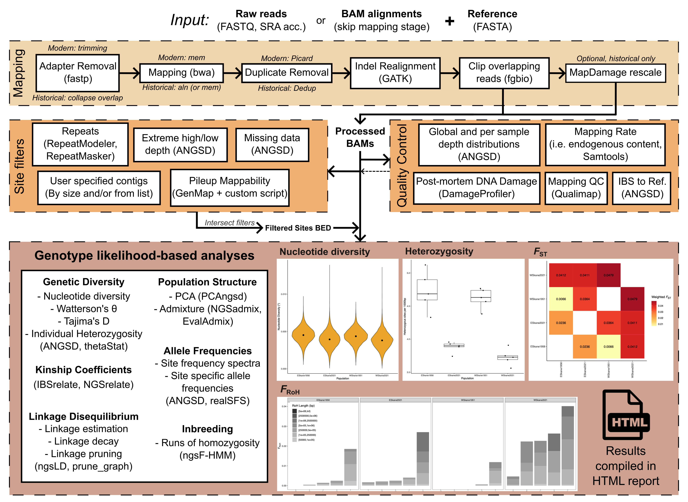

# PopGLen: A snakemake pipeline for performing population genomic analyses using genotype likelihood based methods

> With v0.4.0, the pipeline is ready for use and all planned components have
> been added in. If you would like to suggest a feature or report a bug, please
> submit an issue.
>
> If interested in using the pipeline, feel free to check out its current
> [documentation](https://zjnolen.github.io/PopGLen/v0.4.0/).

This pipeline is aimed at processing sequencing data and calculating population
genomic statistics within a genotype likelihood framework using a common
workflow based on ANGSD and related softwares. As a primary use case of genotype
likelihood based methods is analysis of samples sequenced to low depth or from
degraded samples, processing can optionally be adapted to account for DNA
damage. It is aimed at single and multi-population analyses of samples mapped to
the same reference, so is appropriate for datasets containing individuals from a
single or multiple populations and allows for examining population structure,
genetic diversity, genetic differentiation, allele frequencies, linkage
disequilibrium, and more.

The workflow is designed with two entry points in mind. Users with raw
sequencing data in FASTQ format stored locally or as an NCBI/ENA run accession
can perform raw sequencing data alignment and processing, followed up by the
population genomic analyses. Alternatively, users who have already mapped and
processed their reads into BAM files can use these to start directly at the
population genomic analyses (for instance, if you bring BAM files from
GenErode, nf-core/eager, or your own custom processing).

## Documentation

The main documentation for the pipeline is
[here](https://zjnolen.github.io/PopGLen/v0.4.0/), with a broad summary of
features reported in this README.

Included in this documentation is a
[tutorial](https://zjnolen.github.io/PopGLen/v0.4.0/tutorial/) which you can
perform to become familiar with using PopGLen.

## Features

This pipeline is largely composed of four modular components (1) sequence data
processing (mapping), (2) site filtering, (3) quality control, and (4) genotype
likelihood-based population genomic analyses. Each component is individually
enableable and users can start from raw FASTQ files or processed BAM files.
Configuration can be changed at any point and appropriate analyses will be
re-run, allowing for configuration to be modified in light of quality control
results. Upon completing any portion of the workflow, a report can be generated
that summarizes the main results, with the plots in the above figure being
examples of some of the plots generated for the report.

[You can find an example of the report with most of the analyses included here](https://zjnolen.github.io/popglen-tutorial-reports/tutorial-full-data.html).

### Sequence data processing

If starting with raw sequencing data in FASTQ format, the pipeline will handle
mapping and processing of the reads, with options speific for historical DNA.
These steps are available if providing paths to local FASTQ files or SRA
accessions from e.g. NCBI/ENA.

- Trimming and collapsing of overlapping paired end reads with fastp[^1]
- Mapping of reads using bwa[^2] mem (modern) or aln (historical)
- Estimation of read mapping rates (for endogenous content calculation) with
  Samtools[^3]
- Removal of duplicates using Picard[^4] for paired reads and dedup[^5] for
  collapsed overlapping reads
- Realignment around indels using GATK[^6]
- Optional base quality recalibration using MapDamage2[^7] in historical
  samples to correct post-mortem damage or damage estimation only with
  DamageProfiler[^8]
- Clipping of overlapping mapped paired end reads using BamUtil[^9]
- Quality control information from fastp, Qualimap[^10], DamageProfiler, and
  MapDamage2 (Only Qualimap is available for samples starting from user-provided
  BAMs). Additionally, several filtered and unfiltered depth statistics as well
  as reference bias are calculated using ANGSD.

### Population Genomics

The primary goal of this pipeline is to perform analyses in ANGSD and related
softwares in a repeatable and automated way. These analyses are available both
when you start with raw sequencing data or with processed BAM files.

- Estimation of linkage disequilibrium across genome and LD decay using
  ngsLD[^11]
- Linkage pruning where relevant with
  [fgvieira/prune_graph](https://github.com/fgvieira/prune_graph)
- PCA with PCAngsd[^12]
- Admixture with NGSAdmix[^13]
- Relatedness using IBSrelate[^14] or NgsRelate[^15]
- 1D and 2D Site frequency spectrum production with ANGSD[^16], bootstrap SFS
  can additionally be generated.
- Diversity and statistics per population (Watterson's theta, pairwise
  nucleotide diversity, Tajima's D) in user defined sliding windows with ANGSD
- Estimation of heterozygosity per sample from 1D SFS with ANGSD, with
  confidence intervals from bootstraps
- Pairwise $F_{ST}$ between all populations or individuals in user defined
  sliding windows with ANGSD
- Inbreeding coefficients and runs of homozygosity per sample with
  ngsF-HMM[^17] (**NOTE** This is currently only possible for samples that are
  within a population sample, not for lone samples which will always return an
  inbreeding coefficient of 0. To remedy this, ngsF-HMM can be run for the
  whole dataset instead of per population, but this may break the assumption
  of Hardy-Weinberg Equilibrium)
- Identity by state (IBS) matrix between all samples using ANGSD
- Population allele frequencies using ANGSD

Additionally, several data filtering options are available:

- Identification and removal of repetitive regions using
  RepeatModeler[^18]/Masker[^19] (can skip RepeatModeler if repeat library is
  supplied and skip RepeatMasker if repeat bed/gff is supplied)
- Removal of regions with low mappability for fragments of a specified size.
  Mappability estimated with GenMap[^20] and converted to 'pileup mappability'
  using a custom script.
- Removal of regions with extreme high or low global depth
- Global filtering of sites based on missing data
- Multiple filter sets from user-provided BED files that can be intersected
  with other enabled filters using BEDTools [^21] (for instance, performing
  analyses on neutral sites and genic regions separately)

All the above analyses can also be performed with sample depth subsampled to
a uniform level with Samtools to account for differences in depth between
samples.

A workflow report containing outputs from QC and analyses can be generated.

## Snakemake profiles

To make running this workflow easier on systems I have tested it on, I've
included an example profile for:

- PDC's Dardel System [profiles/dardel](profiles/dardel)

The above should be called with the `--profile` option if used.

There is also a default workflow-specific profile
([profiles/default](profiles/default)) where resources can be
modified easily. This is called with the `--workflow-profile` option, but is
automatically enabled if left in `profiles/default` in the working directory.

## Acknowledgements

The computations required for developing and testing this workflow has been
enabled by resources provided by the National Academic Infrastructure for
Supercomputing in Sweden (NAISS) and the Swedish National Infrastructure for
Computing (SNIC) at UPPMAX partially funded by the Swedish Research Council
through grant agreements no. 2022-06725 and no. 2018-05973. This pipeline was
developed on the following small compute projects: SNIC 2022/22-427,
NAISS 2023/22-600, and NAISS 2024/22-996.

## References

Below you can find the references for various softwares utilized in this
pipeline which should be cited if their portion of the pipeline is used. How
each tool is used is given with the reference.

[^1]: Chen, S., Zhou, Y., Chen, Y., & Gu, J. (2018). fastp: An ultra-fast all-in-one FASTQ preprocessor. Bioinformatics, 34(17), i884–i890. <https://doi.org/10.1093/bioinformatics/bty560>
(Adapter trimming, read collapsing, fastq QC)

[^2]: Li, H., & Durbin, R. (2009). Fast and accurate short read alignment with Burrows–Wheeler transform. Bioinformatics, 25(14), 1754–1760. <https://doi.org/10.1093/bioinformatics/btp324>
(Read mapping)

[^3]: Danecek, P., Bonfield, J. K., Liddle, J., Marshall, J., Ohan, V., Pollard, M. O., Whitwham, A., Keane, T., McCarthy, S. A., Davies, R. M., & Li, H. (2021). Twelve years of SAMtools and BCFtools. GigaScience, 10(2). <https://doi.org/10.1093/gigascience/giab008>
(Endogenous content calculation, depth subsampling, bam file manipulation)

[^4]: Picard toolkit. (2019). Broad Institute, GitHub Repository. <https://broadinstitute.github.io/picard/>
(Duplicate removal for paired end reads)

[^5]: Peltzer, A., Jäger, G., Herbig, A., Seitz, A., Kniep, C., Krause, J., & Nieselt, K. (2016). EAGER: Efficient ancient genome reconstruction. Genome Biology, 17(1), Article 1. <https://doi.org/10.1186/s13059-016-0918-z>
(Duplicate removal for collapsed reads)

[^6]: Auwera, G. A. V. der, & O’Connor, B. D. (2020). Genomics in the Cloud: Using Docker, GATK, and WDL in Terra. O’Reilly Media, Inc.
(Realignment around indels)

[^7]: Jónsson, H., Ginolhac, A., Schubert, M., Johnson, P. L. F., & Orlando, L. (2013). mapDamage2.0: Fast approximate Bayesian estimates of ancient DNA damage parameters. Bioinformatics, 29(13), 1682–1684. <https://doi.org/10.1093/bioinformatics/btt193>
(Estimation of post-mortem DNA damage, base recalibration for damage
correction)

[^8]: Neukamm, J., Peltzer, A., & Nieselt, K. (2021). DamageProfiler: Fast damage pattern calculation for ancient DNA. Bioinformatics, 37(20), 3652–3653. <https://doi.org/10.1093/bioinformatics/btab190>
(Estimation of post-mortem DNA damage)

[^9]: Jun, G., Wing, M. K., Abecasis, G. R., & Kang, H. M. (2015). An efficient and scalable analysis framework for variant extraction and refinement from population scale DNA sequence data. Genome Research, gr.176552.114. <https://doi.org/10.1101/gr.176552.114>
(Clipping of overlapping reads so they are not double counted by ANGSD)

[^10]: García-Alcalde, F., Okonechnikov, K., Carbonell, J., Cruz, L. M., Götz, S., Tarazona, S., Dopazo, J., Meyer, T. F., & Conesa, A. (2012). Qualimap: Evaluating next-generation sequencing alignment data. Bioinformatics, 28(20), 2678–2679. <https://doi.org/10.1093/bioinformatics/bts503>
(General BAM file QC)

[^11]: Fox, E. A., Wright, A. E., Fumagalli, M., & Vieira, F. G. (2019). ngsLD: Evaluating linkage disequilibrium using genotype likelihoods. Bioinformatics, 35(19), 3855–3856. <https://doi.org/10.1093/bioinformatics/btz200>
(Estimation of linkage disequilibrium for pruning, LD decay, LD sampling)

[^12]: Meisner, J., & Albrechtsen, A. (2018). Inferring Population Structure and Admixture Proportions in Low-Depth NGS Data. Genetics, 210(2), 719–731. <https://doi.org/10.1534/genetics.118.301336>
(Principal component analysis)

[^13]: Skotte, L., Korneliussen, T. S., & Albrechtsen, A. (2013). Estimating Individual Admixture Proportions from Next Generation Sequencing Data. Genetics, 195(3), 693–702. <https://doi.org/10.1534/genetics.113.154138>
(Admixture analysis)

[^14]: Waples, R. K., Albrechtsen, A., & Moltke, I. (2019). Allele frequency-free inference of close familial relationships from genotypes or low-depth sequencing data. Molecular Ecology, 28(1), 35–48. <https://doi.org/10.1111/mec.14954>
(Relatedness estimation)

[^15]: Hanghøj, K., Moltke, I., Andersen, P. A., Manica, A., & Korneliussen, T. S. (2019). Fast and accurate relatedness estimation from high-throughput sequencing data in the presence of inbreeding. GigaScience, 8(5), giz034. <https://doi.org/10.1093/gigascience/giz034>
(Relatedness estimation)

[^16]: Korneliussen, T. S., Albrechtsen, A., & Nielsen, R. (2014). ANGSD: Analysis of Next Generation Sequencing Data. BMC Bioinformatics, 15(1), Article 1. <https://doi.org/10.1186/s12859-014-0356-4>
(Depth calculation, genotype likelihood estimation, SNP calling, allele
frequencies, SFS, diverity and neutrality statistics, heterozygosity, $F_{ST}$)

[^17]: Vieira, F. G., Albrechtsen, A., & Nielsen, R. (2016). Estimating IBD tracts from low coverage NGS data. Bioinformatics, 32(14), 2096–2102. <https://doi.org/10.1093/bioinformatics/btw212>
(Inbreeding and runs of homozygosity estimation)

[^18]: Flynn, J. M., Hubley, R., Goubert, C., Rosen, J., Clark, A. G., Feschotte, C., & Smit, A. F. (2020). RepeatModeler2 for automated genomic discovery of transposable element families. Proceedings of the National Academy of Sciences, 117(17), 9451–9457. <https://doi.org/10.1073/pnas.1921046117>
(Building repeat library from reference genome)

[^19]: Smit, A., Hubley, R., & Green, P. (2013). RepeatMasker Open-4.0 (4.1.2) [Computer software]. <http://www.repeatmasker.org>
(Identifying repeat regions from repeat library)

[^20]: Pockrandt, C., Alzamel, M., Iliopoulos, C. S., & Reinert, K. (2020). GenMap: Ultra-fast computation of genome mappability. Bioinformatics, 36(12), 3687–3692. <https://doi.org/10.1093/bioinformatics/btaa222>
(Estimation of per-base mappability scores)

[^21]: Quinlan, A. R. & Hall, I. M. (2010). BEDTools: a flexible suite of utilities for comparing genomic features. Bioinformatics, 26(6), 841-842. <https://doi.org/10.1093/bioinformatics/btq033>
(Transforming and intersecting filter files)
