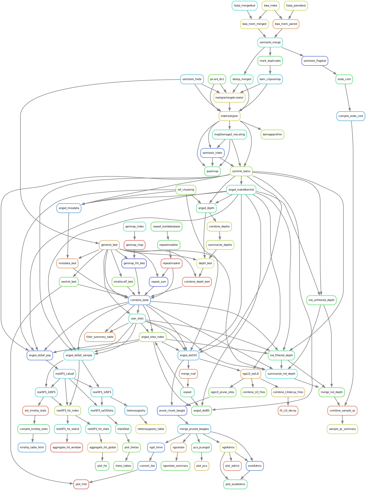

# Genotype likelihood population genomics pipeline

This workflow is aimed at processing raw sequencing reads and calculating
population genomic statistics within a genotype likelihood framework. As it is
focused on GL methods, it has options to adapt the workflow for processing data
with low or variable coverage and/or contains historical/ancient samples with
degraded DNA. It is under active development, so new features will be added.

## Getting Started

To run this workflow, you'll need paired-end raw sequencing data and a
reference genome to map it to. Currently, the workflow is only compatiblity
with datasets containing only a single library and paired-end sequencing run
per sample, and reference genomes must be uncompressed.

To run the workflow, you will need to be working on a machine with the
following:

- Conda (or, preferably, it's drop-in replacement mamba)
- Singularity/Apptainer

Once these softwares are installed, to deploy and configure the workflow, you
can follow the instructions provided in the [Snakemake workflow catalog](https://snakemake.github.io/snakemake-workflow-catalog/?usage=zjnolen/angsd-snakemake-pipeline).
You can refer to the Snakemake Documentation for additional information that
may be relevant to your computing environment (running jobs through cluster job
queues, setting default resources).

### Notes on inputs

Reference genomes should be uncompressed, and contig names should be clear and
concise. Currently, there are some issues parsing contig names with
underscores, so please change these in your reference before running the
pipeline. Alphanumeric characters, as well as `.` in contig names have been
tested to work so far, other symbols have not been tested.

Potentially the ability to use bgzipped genomes will be added, I just need to
check that it works with all underlying tools. Currently, it will for sure not
work, as calculating chunks is hard-coded to work on an uncompressed genome.

### Running on a cluster

Development was done on UPPMAX's Rackham cluster, and a simple profile is
included in the [`rackham`](rackham) folder to simplify running this workflow
through SLURM there. For running on other SLURM based cluster configs, this
file should largely work with a few minor modifications of the defaults.
Primarily, this means ensuring that the resources make sense for your system,
i.e. changing the default partition and account. Not changing the default
memory may result in over-reserving memory in some cases, but a quick fix would
be to change `6400` to whatever the default memory reserved per cpu is on your
HPC (though then you might need to up the threads requested fo in some rules).
See [Snakemake's cluster support documentation](https://snakemake.readthedocs.io/en/stable/executing/cluster.html)
for information on how to adapt the profile for your HPC environment.

#### Resources (and what to do if the workflow is over/underbooking resources)

As Rackham ties memory reservations to cpu reservations, the resource
allocation for rules is mostly done through threads currently. In the future
thread and memory resources will be more explicitly defined. For now, if you
find that the workflow is over/underbooking a given resource, you can adjust
the resource reservations in your run profile. See the commented section in
the [`rackham/config.yaml`](rackham/config.yaml) config to see an example of
this.

## Features

Currently, the pipeline performs the following tasks:

### Reference genome preparation

- Indexing of reference for subsequent analyses

### Raw read preparation

- Trimming of paired-end reads from high quality libraries
- Collapsing of paired-end reads from fragmented (aDNA/historical DNA)
libraries

### Read mapping

- Mapping prepared raw reads to reference using bwa-mem and clipping of
  overlapping reads, combining of multiple sample runs/libraries
  - **NOTE**: Reads marked as historical (degraded) will only map reads short
    reads that overlap and collapse, to reduce mapping of likely contaminants.
- Removal of PCR and sequencing duplicates separately for fresh (Picard) and
  fragmented (DeDup) DNA reads
- Realignment around indels
- Optional recalibration of base quality scores on degraded DNA bam files with
  [MapDamage2](https://ginolhac.github.io/mapDamage/)
- Indexing of deduplicated, realigned, mapped, and recalibrated reads

### Sample quality control

- Assess post-mortem DNA damage with DamageProfiler
- Assess mapping quality stats with Qualimap
- Assess endogenous content using mapping proportion before duplicate reads are
  removed

### Data quality filtering

- Analyses can be set with minimum mapping and base quality thresholds
- Exclusion of entire scaffolds (i.e. sex-linked, low quality) through user
  config (both list and contig size based)
- Exclusion of repeat regions from analyses using RepeatModeler/RepeatMasker
- Exclusion of low mappability regions with GenMap
- Exclusion of sites with extreme global depth values (determined separately
  for the entire dataset, and subsets at certain coverage ranges, then merged)
- Exclusion of sites based on data missingness across dataset and/or per
  population
- Filter using any number of additional user-defined BED files

### GL based population genomic analyses

To speed up the pipeline, many of these analyses are done for part of the
genome at a time, then later merged. This is only done for analyses where
possible and where the time saved is appreciable. These chunks are made to be a
user configured size to allowtuning of run-times (i.e. more jobs, shorter
runtimes vs fewer jobs, longer runtimes).

SAF based analyses are done on variable and non-variable sites passing quality
filters. This set is the same across all populations in the dataset and is
based on the positions passing all the requested filters. Beagle (SNP) based
analyses are done on a SNP set that is constant across all populations,
determined from the output of the Beagle file for the whole dataset, and major
and minor alleles are inferred from the whole dataset. When relevant, pruned
SNPs are used. Pruning is done on the whole dataset beagle file and the same
pruned sites are used for all populations.

Additionally, all analyses can be repeated with samples subsampled to a lower
user configured depth. This helps to ensure results are not simply due to
variance in depth between groups.

**Analyses:**

- Estimation of linkage disequilibrium across genome and LD decay using ngsLD
- Linkage pruning where relevant with ngsLD
- PCA with PCAngsd
- Admixture with NGSAdmix
- Relatedness using NgsRelate and methods from Waples et al. 2019, *Mol. Ecol.*
- 1D and 2D Site frequency spectrum production with ANGSD
- Neutrality statistics per population (Watterson's theta, pairwise pi,
  Tajima's D) in user defined sliding windows with ANGSD
- Estimation of heterozygosity per sample from 1D SFS with ANGSD
- Pairwise $F_{ST}$ between all populations or individuals in user defined
  sliding windows with ANGSD
- Inbreeding coefficients and runs of homozygosity per sample with ngsF-HMM
  (**NOTE** This is currently only possible for samples that are within a
  population sampling, not for lone samples which will always return an
  inbreeding coefficient of 0)
- Pairwise $F_{ST}$ between all populations or individuals in user defined
  sliding windows with ANGSD
- Identity by state (IBS) matrix between all samples using ANGSD

### Planned

Some additional components to the pipeline are planned, the order below roughly
corresponding to priority:

- Add calculation of bootstrapped SFS
- Manhattan plots in report for sliding window results
- Allow starting with bam files - for those that want to process raw reads in
  their own way before performing analyses
- Add calculation of Dxy
- Add schema for configuration files to improve incorrect format handling and
  to enable defaults

## Workflow directed action graph

Below is a graph of the workflow with most of the analyses enabled. This is
generated directly by Snakemake, though I have removed the `all`, `popfile`,
and `link_ref` rules to improve readability, as they are not needed to
understand the analysis flow. A more condensed, readable diagram will be added
shortly.

In general, there a few stages that can be seen grouping here. A mapping stage
at the top, ending with `symlink_bams`, followed by the creation of a set of
filters for the dataset that ends with `combine_beds`. Afterwards, population
genetic analyses are performed in primarily two pathways - allele frequency
based results (starting with `angsd_doSaf_sample/pop`) and SNP based results
(starting with `angsd_doGlf2` (beagle)).

## Acknowledgements

The computations required for developing and testing this workflow has been
enabled by resources provided by the National Academic Infrastructure for
Supercomputing in Sweden (NAISS) and the Swedish National Infrastructure for
Computing (SNIC) at UPPMAX partially funded by the Swedish Research Council
through grant agreements no. 2022-06725 and no. 2018-05973.
