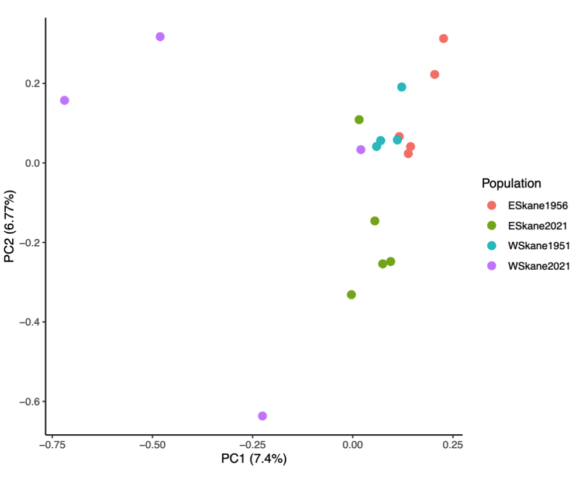

# Extending or modifying analyses in PopGLen

Using PopGLen as a Snakemake module makes it easy to incorporate extensions to
it in the Snakefile, enabling cusomization of the workflow. This means that you
can extend upon the workflow with your own rules that use PopGLen outputs as
their input, keeping the project as one contained workflow that can be easily
reproduced. This functionality could also allow for replacement of some of
PopGLen's analyses with alternative options, such as estimating the covariance
matrix for PCA with single read sampling in ANGSD rather than the likelihood
based approach of PCAngsd. Most of this is covered in Snakemake's documentation
on [modularization](https://snakemake.readthedocs.io/en/stable/snakefiles/modularization.html),
and all methods described there should be compatible with PopGLen.

As an example, we will replace the PCA produced using PCAngsd in PopGLen
with one produced using a covariance matrix from single read sampling using
ANGSD. This should only really add one step, estimating the covariance matrix
in ANGSD instead of PCAngsd. We start with a bare bones Snakefile that imports
PopGLen as a module:

```py title="workflow/Snakefile" linenums="1"
from snakemake.utils import min_version


min_version("6.10.0")


configfile: "config/config.yaml"


# declare https://github.com/zjnolen/PopGLen as a module
module popglen:
    snakefile:
        github("zjnolen/PopGLen", path="workflow/Snakefile", tag="v0.4.1")
    config:
        config


# use all rules from https://github.com/zjnolen/PopGLen
use rule * from popglen
```

As is, it will run PopGLen as described in the documentation. To utilize a
covariance matrix estimated by something other than PCAngsd when generating the
PCA, we need to do two things: (1) add a rule to generate the covariance matrix
with the other tool and (2) overwrite the input for the rule that runs the
principal component analysis with this new covariance matrix.

We will do this by adding the code block below to the end of the Snakefile. It
first defines a rule, `angsd_doCov`, which generates the covariance matrix. This
is very similar to the `angsd_doIBS` rule already in PopGLen, so much of that
rule can be repurposed into this one. After we add the rule, we then simply
tell Snakemake that when it imports the rule `plot_pca` from PopGLen, it
should use this covariance matrix made by `angsd_doCov` instead of the one from
PCAngsd defined by default.

```py title="workflow/Snakefile linenums="21"
# Add a rule which estimates the covariance matrix, but from single read
# sampling in ANGSD rather than genotype likelihoods in PCAngsd


rule angsd_doCov:
    """
    Estimates covariance matrix for all individuals.
    """
    input:
        bamlist="results/datasets/{dataset}/bamlists/{dataset}.{ref}_{population}{dp}.bamlist",
        bams=popglen.get_bamlist_bams,
        bais=popglen.get_bamlist_bais,
        sites="results/datasets/{dataset}/filters/snps/{dataset}.{ref}_{population}{dp}_{sites}-filts_snps.sites",
        idx="results/datasets/{dataset}/filters/snps/{dataset}.{ref}_{population}{dp}_{sites}-filts_snps.sites.idx",
    output:
        ibs=temp("results/datasets/{dataset}/analyses/covar/{dataset}.{ref}_{population}{dp}_{sites}-filts.ibs.gz"),
        covmat="results/datasets/{dataset}/analyses/covar/{dataset}.{ref}_{population}{dp}_{sites}-filts.covMat",
        arg="results/datasets/{dataset}/analyses/covar/{dataset}.{ref}_{population}{dp}_{sites}-filts.arg",
    container:
        popglen.angsd_container
    params:
        mapQ=config["mapQ"],
        baseQ=config["baseQ"],
        trans=popglen.get_trans,
        out=lambda w, output: os.path.splitext(output.arg)[0],
    threads: 2
    resources:
        runtime="1d",
    shell:
        """
        angsd -doIBS 1 -doCov 1 -bam {input.bamlist} -nThreads {threads} \
            -doCounts 1 -minMapQ {params.mapQ} -minQ {params.baseQ} \
            -sites {input.sites} -rmTrans {params.trans} -doMajorMinor 3 \
            -out {params.out}
        """


# Update plot_pca rule to use the covariance matrix from angsd_doCov rather than
# from PCAngsd


use rule plot_pca from popglen as plot_pca with:
    input:
        "results/datasets/{dataset}/analyses/covar/{dataset}.{ref}_{population}{dp}_{sites}-filts.covMat",
        "results/datasets/{dataset}/poplists/{dataset}_{population}{dp}.indiv.list",

```

For a substitution like this, these are the only changes we need to make.
You can try running this Snakefile using the [tutorial](tutorial.md) data to see
it in action. These two methods actually produce quite similar results with the
tutorial dataset (though the axis of PC2 is inverted, as its direction is
arbitrary):

| PCAngsd covariance matrix | ANGSD -doCov covar matrix |
|---------------------------|---------------------------|
|||

Extending workflows like this allows you to use PopGLen as a base for your
project, adding additional analyses as you need them. If you have an analysis
(or alternative tool for an analysis) that you feel suits PopGLen (i.e. is
suited for low-coverage population genomics), but is not yet implemented, please
feel free to open an issue and request its addition.
