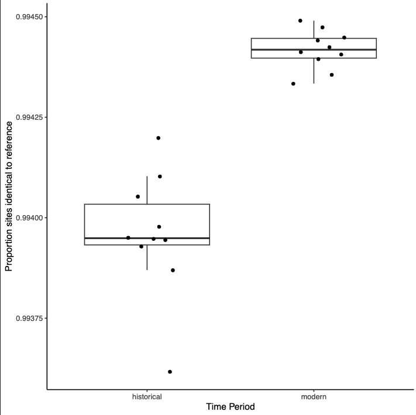
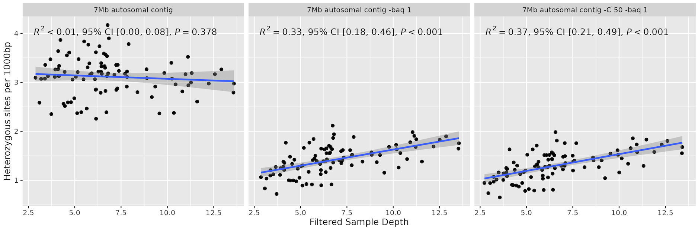
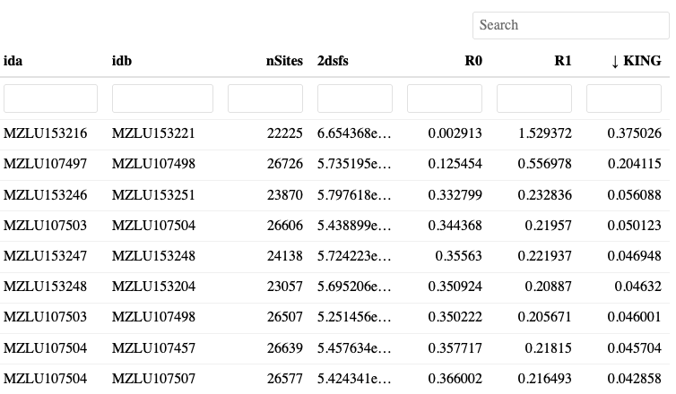
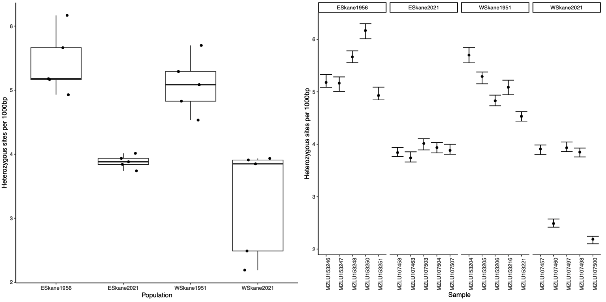
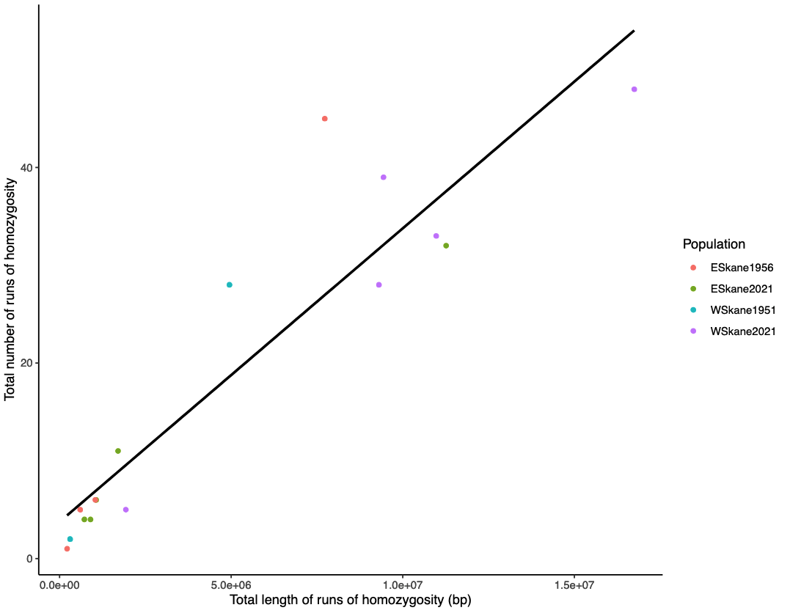

# Tutorial

This tutorial aims to get users familiar with the general usage of PopGLen by
walking through a small(ish) dataset. Users can walk through this dataset to get
familiar with using PopGLen on their server/machine, or can use it as a template
to follow along with their own data, modifying settings when suitable.

The tutorial dataset is a subset of the data used in
[this manuscript](https://doi.org/10.1101/2024.10.07.616612) and contains
sequencing data for 20 *Cyaniris semiargus* butterfly individuals from southern
Sweden. These samples all come from the province of Skåne, a region where
grassland cover has considerably declined over the past century as agriculture
has intensified. In this tutorial, 10 individuals come from historical samples
from the entomological collections of the Biological Museum, Lund University,
half from a locality in western Skåne and the other from a locality in eastern
Skåne. The other 10 individuals come from modern samples collected in nearby
localities in 2021, which will allow us to compare genomic metrics over time.
This is one of the main use cases for PopGLen - a dataset with both modern and
historical samples, but most of the functionality will be the same if your
dataset has only modern or only historical samples.

For reference, I have included a report that utilizes the full data, which can
be useful to reference to get a better idea of what the results would look like
with real data. [[Full report]](https://zjnolen.github.io/popglen-tutorial-reports/tutorial-full-data.html)

??? note "How much of the original data is in the tutorial dataset?"
    To speed up processing times for the purpose of the tutorial, I only
    included ~10Mb across four chromosomes of the *Cyaniris semiargus*
    reference and enough reads to get 2-5X sequencing depth across that region.
    This is enough to get close to the results from the full genome, but some
    analyses will be more impacted than others. I will mention when this is the
    case, and include the results using the full data alongside the tutorial
    data for comparison.

## Prepping the workflow

To run PopGLen, you will need access to Conda/Mamba and Apptainer/Singularity as
these will be used to run and install the software utilized in the pipeline,
including Snakemake. Due to the Apptainer/Singularity requirement, this means
that it will only run on Linux machines. I recommend performing the tutorial on
the machine you are likely to run your dataset on, rather than testing it on
your local machine.

Once you have installed Conda/Mamba and Apptainer/Singularity on your machine,
you're ready to start setting up the environment for PopGLen to use. We will
install a simple conda environment with Snakemake, the only dependency needed:

``` bash
conda create -n popglen \
    -c conda-forge -c bioconda \
    snakemake=8.20 snakedeploy
```

Once run, this will install Snakemake and Snakedeploy to the environment
'popglen', which we will activate to download and run the pipeline:

``` bash
conda activate popglen
```

Now, create a working directory for your project, deploy the workflow inside:

``` bash
snakedeploy deploy-workflow https://github.com/zjnolen/PopGLen . --tag v0.4.0
```

This will download a `workflow` and `config` folder containing a the workflow
file and a configuration template. Now we are ready to set up our dataset.

## Prepping the dataset

If you are following along with the tutorial data, please download it
from Figshare [here](https://doi.org/10.6084/m9.figshare.27453978.v1). You can
download it in the command line using the following command:

```bash
wget -O popglen-tut-data.zip https://figshare.com/ndownloader/articles/27453978/versions/1
```

This dataset contains three folders: `data`, `config`, and `resources`. These
contain the raw fastq reads, configuration files, and subset reference genome,
respectively. Move these three folders into the base of your working directory,
where we deployed the workflow. You'll be replacing the contents of the `config`
folder that was deployed with the workflow with what's in the `config` in the
tutorial data.

??? note "Example set up code for tutorial"
    Here is an example of how the tutorial can be deployed, with explicit
    commands.

    ```bash
    # First, create a working dir
    mkdir popglen-tutorial
    
    # Change into it
    cd popglen-tutorial
    
    # deploy the workflow in here
    snakedeploy deploy-workflow https://github.com/zjnolen/PopGLen . --tag v0.4.0

    # download the tutorial data
    wget -O popglen-tut-data.zip https://figshare.com/ndownloader/articles/27453978/versions/1

    # unzip the tutorial data
    unzip popglen-tut-data.zip

    # move the contents of the tutorial data folder into the working dir
    mv popglen-tutorial-data/data popglen-tutorial-data/resources ./
    mv popglen-tutorial-data/config/* config/

    # remove the zip file and unzipped folder
    rm -r popglen-tutorial-data popglen-tutorial-data.zip
    ```

    This should get you set up as expected.

Let's take a look at the configuration files in the tutorial data. First, our
sample list:

``` title="config/samples.tsv"
--8<-- "docs/files/samples.tsv"
```

Here, we list all the samples we will use, the population identifiers we will
group them by, the time period they come from, and the sequencing depth category
we will assign them to. There is one line per sample, and there can be as many
or as few population groups as you'd like.

Time must be 'modern' or 'historical' and decides how samples will be treated
when modern and historical samples are treated differently. If all your samples
are modern, you can simply leave all as modern.

Depth groups samples into depth categories that allow depth filtering to be done
per category. This can help to ensure that if you have samples with considerable
differences in depth, your depth filters won't be exclusively acting on the
upper tail of the distribution driven by high coverage samples and the lower
tail driven by low coverage samples. You can have as many or as few depth
categories as you want, with whatever names you would like, but they should not
use names that also appear in other columns (i.e. use 'low' rather than
'historical' or 'pop1depth' rather than reusing 'pop1' from the population
column).

Now, for the units list, which points to our data files:

``` title="config/units.tsv"
--8<-- "docs/files/units.tsv"
```

Here, we point to the data for each sample, and assign sequencing metadata. We
are using FASTQ inputs for this tutorial, so we will fill out (1) the 'unit', an
identifier for the sequencing lane (here it is the run barcode and lane number),
(2) the 'lib', an identifier for the library batch the reads come from, (3) the
'platform', the sequencing platform they were run on, and (4) 'fq1' and 'fq2',
the paths to the forward and reverse read fastq files (either absolute or
relative to the working directory). You can have multiple lines per sample if
you have multiple combinations of sequencing runs and/or libraries per sample,
and these will be merged at the appropriate steps by the workflow. You can also
use SRA accession numbers to download the FASTQ data if it is not local by
replacing the 'fq1' and 'fq2' columns with an 'sra' column and filling it out
with the accession number. If we were starting with BAM files, we could omit all
the columns except 'sample', and add one column 'bam' that points to the BAM
file.

Now, we are ready for the configuration.

## Initial configuration

The `config/config.yaml` file included with the tutorial dataset has the basic
configuration filled out. It contains all the available options for the
workflow, with some default parameters and most analyses turned off. There is an
additional file, `config/config-full.yaml`, that enables all the tutorial
analyses, allowing the entire tutorial to be run in one Snakemake run. For
details on all the settings in the config file, please see the
[configuration documentation](config.md).

No matter what analyses are to be run, the first two sections of the config are
required:

```yaml linenums="1" title="config/config.yaml"
#=====================Dataset Configuration============================#

samples: config/samples.tsv

units: config/units.tsv

dataset: "popglen-tutorial"

#===================== Reference Configuration ========================#

chunk_size: 12000000

reference:
  name: "tutorial-ref" 
  fasta: "resources/ref/ilCyaSemi1.1_tutref.fa"
  mito: ["mitochondrion"]
  sex-linked: ["Z"]
  exclude: []
  min_size: 1000000

ancestral:
```

Here, we set a few important settings:

- `samples` points to the sample list file
- `units` points to the unit list file
- `dataset` gives a name for the dataset run (multiple datasets can be run in
  the same working dir and reuse generated BAMs and reference resources when
  possible)
- `chunk_size` sets a size for the genome to be chunked into. This allows for
  parallelizing over genomic regions where possible, but without running into
  issues when genomes have a high number of contigs. It should be a value equal
  to or greater than the largest contig length in your genome. If you have a
  chromosome level genome, the size of the biggest chromosome is probably best.
  If you have something less contiguous, it depends on how many jobs you expect
  to run in parallel. I have mostly worked with 500Mb genomes, setting this to
  30Mb usually. For the tutorial, we will actually set it to a value larger than
  the tutorial genome, as it is already rather small, ~10Mb.
- `reference/name` is a name for the reference genome you're mapping/mapped to.
  It will be included in the output file names of the BAM alignments and many
  other files.
- `reference/fasta` is the path to the reference genome FASTA. It must be
  locally available and should not be compressed. (Open an issue of using a
  compressed reference FASTA is something you'd much prefer and I will look into
  making it possible.)
- `reference/mito` is a list of any mitochondrial scaffolds. They will be
  excluded from analyses (future versions may include some mitochondrial
  analyses). In the tutorial, we drop the sequence called 'mitochondrion'.
- `reference/sex-linked` is a list of any sex linked scaffolds. They will be
  excluded from analyses (future versions may include ways to analyze these).
  In the tutorial, we drop the 'Z' chromosome.
- `reference/exclude` is a list of scaffolds to exclude that aren't in any other
  category of this section. We won't put anything here this time.
- `reference/min_size` is a minimum size required to include a scaffold. If you
  have many small scaffolds, you can set a threshold to drop them. We only have
  one small scaffold in the tutorial reference, the mitochondrion, and since it
  is smaller than the 1Mb we set here, it will be dropped by this setting, even
  if it wasn't listed in the `reference/mito` section.
- `ancestral` is a FASTA file containing ancestral states for your reference
  genome. Several analyses can utilize ancestral states for polarization of the
  site frequency spectrum, providing derived/ancestral allele counts rather than
  major/minor. If you have one, you can put it here, but know that analyses that
  use it will be limited to the sites with data in this sequence. We don't have
  one, so we won't use it and will 'fold' our site frequency spectra to account
  for this. The main outputs of the workflow largely are suitable with folded
  spectra.

## Running the pipeline

With these basic configurations complete, the pipeline is ready to run.
Snakemake allows us to do a dry run with the option `-n`:

```bash
snakemake \
  --use-conda --use-singularity \
  --default-resources "mem_mb=(threads*1700)" \
  --cores <threads> \
  -n
```

As this pipeline uses conda environments and singularity containers,
`--use-conda` and `--use-singularity` are always required. `--default-resources`
is needed for some rules that require knowledge of memory usage (primarily java
tools), where we give 1700MB of memory per thread used in each rule. `--cores`
is needed for local runs and should be set to the number of cores you'd like to
give to PopGLen for a local run.

!!! note "Running with a job scheduler"
    For this tutorial, I have shown the command for a local run. This is good if
    you are running on a machine without a job scheduler or if you want to
    submit the workflow to run inside a single large job on your cluster. The
    latter is probably the best way to run the tutorial, but for large datasets,
    it is likely most efficient to use Snakemake's executor plugins to have it
    submit each job in the workflow as its own job in your scheduler, maximizing
    the parallelization potential across multiple nodes. While the best place
    for how to set this up is the
    [Snakemake documentation](https://snakemake.readthedocs.io/en/stable/executing/cli.html#non-local-execution),
    I have also made a [brief doc](cluster-execution.md) on this here.

When we do a dry run, we should see that with the default options, Snakemake
plans to do only the raw sequence data processing, i.e. adapter trimming,
collapsing of historical read pairs, mapping to the reference, duplicate
removal, indel realignment, clipping of overlapping reads for modern samples,
and indexing of the final processed BAMs.

## Quick start vs. Walkthrough

I've written the rest of this tutorial with two approaches in mind: a 'quick
start' and a 'walkthrough'.

The quick start approach starts with a configuration with all analyses enabled.
This means Snakemake will run the entire tutorial in a single run, you can then
examine the outputs to see what can be done using this pipeline. I recommend
this if you are familiar with a lot of the analyses and with Snakemake and can
use the configuration documentation yourself to adjust settings for your data.

The walkthrough approach starts with a configuration with most analyses disabled
and walks through enabling analyses and running the pipeline piece by piece.
This may help some who are less familiar with the tools to understand how the
analyses fit together.

Regardless of the approach you use for the tutorial, realize that the settings
in the tutorial may not work as well for other datasets, so look into them and
update them for your needs when using your own data. Please feel to reach out in
the issues tracker with questions or to suggest ways the pipeline may be
improved to suit a greater breadth of datasets.

## Option 1: Quick Start

For this, we will perform a whole run using the `config/config_full.yaml`. Your
Snakemake command should look something like this for a local run:

```bash
snakemake \
  --configfile config/config_full.yaml \
  --use-conda --use-singularity \
  --default-resources "mem_mb=threads*1700" \
  --cores <threads>
```

and should be similar, but with cluster/executor configuration options, if using
a system with a job scheduler like SLURM. Note the `--configfile` option, which
overrides the automatic config path (`config/config.yaml`) with the one we put
here. Feel free to do a dry run with `-n` first to see what the pipeline plans
to run.

??? question "How long does the tutorial take to run?"
    This will depend on the system it is run on, as both the number of available
    CPUs and the performance of those CPUs will impact the results. I tested it
    in two environments: (1) in an Ubuntu VM on a 2020 Macbook Pro with 8 cores
    and (2) inside a single job on PDC's Dardel cluster with 64 cores (this is
    half of a node on there). On the Macbook it took ~4 hours to complete the
    whole tutorial, while on Dardel it completed in under half an hour. The
    difference is largely from the number of cores available to perform analyses
    in parallel, but also as the performance of individual cores on the Macbook
    is a bit weaker. Note: I didn't include downloading the Singularity
    containers and setting up the conda environments in this estimate.

First, Snakemake solves the directed action graph - the workflow required to get
from the input files present on the system to the output files requested by our
configuration. Once solved, the required containers and conda environments are
set up and the workflow will begin, with outputs from each step flowing into the
input of the next. Upon completion, we can make a report:

```bash
snakemake \
  --configfile config/config_full.yaml \
  --use-conda --use-singularity \
  --report tutorial_report.html
```

This report contains the main results of all the major analyses, including both
tables and plots. The actual results can be found in the 'results' folder, which
contains the folders 'datasets', 'mapping', 'preprocessing', and 'ref', which
have outputs from the population genomic analyses for different datasets (each
with a subfolder containing the dataset name, for the tutorial it is just one,
which we named `popglen-tutorial` in the config), outputs from the mapping
process, outputs from the trimming process, and outputs specific to the
reference (indices, repeat libraries, etc.), respectively.

## Option 2: Walkthrough

It can be useful to run analyses in batches, assess their outputs, and use these
to inform set up for subsequent analyses. For this walkthrough, we will
gradually change `config/config.yaml` to perform analyses, pointing out
relevant settings in the file as we go. With the first sections matching the
versions shown in [Initial Configuration](#initial-configuration), we are ready
to start the walkthrough. In each step, a report will be made with the results.
These reports are included in this tutorial, so you can just click through them
if you'd rather not run the tutorial on your end.

!!! note "A note on temporary files"
    I have flagged several intermediate files in this workflow as temporary so
    that they will be cleaned up when they are no longer needed. While this is
    great when you're all done with them, if you are enabling pieces of the
    workflow at a time as we are in this tutorial, it can lead to intermediate
    files disappearing after some steps and needing to be re-generated when we
    enable other analyses that use them later down the line. While I've tried to
    avoid making most 'keystone' intermediate files (Beagles, SAFs, etc.)
    temporary, it can be good to use the `--notemp` option in `snakemake`
    commands, which will keep any files marked as temporary. Then, when you know
    you're done, you can run it again without this option to clean up the
    intermediate files.

### Raw sequence data processing and quality control

??? note "I already have BAMs for my data, do I need this part?"
    If you already have BAMs this part may still be relevant to you, as it also
    will run some quality control analyses on the BAM files. I recommend quickly
    reading through it to see the QC options. To make the tutorial more similar
    to what processing your data would be like, I've included the BAM files in
    the tutorial dataset, so you can start from there. Just change the
    `units.tsv` file to look like this:

    ``` title="config/units.tsv"
    --8<-- "docs/files/units_bams.tsv"
    ```

    or, when you run the Snakemake command, you can override the units file
    configuration by adding `--config units="config/units_bams.tsv`.

    If you use this units list and run this section of the tutorial, no mapping
    will be done, only the QC, so it'll be a lot faster to run this section.

The first stage of the pipeline will be to map the raw reads and perform a few
quality control analyses. The mapping pipeline roughly looks like this for each
sample type:

Modern:

1. Quality and adapter trim paired end reads using defaults with fastp
2. Map paired end reads for each sample with bwa mem. Do this individually for
   separate sequencing runs and libraries, then merge with samtools.
3. Remove duplicates with Picard MarkDuplicates.
4. Realign around insertions/deletions with GATK IndelRealigner.
5. Clip overlapping read pairs to avoid double counting reads in ANGSD using
   bamutil.

Historical:

1. Collapse overlapping paired end reads into single strand with fastp.
2. Map collapsed reads to reference with bwa aln.
3. Remove duplicates per library with dedup and merge libraries.
4. Realign around insertions/deletions with GATK IndelRealigner.
5. (Optional, we will not do this for the tutorial) Rescale base quality scores
   to account for DNA damage with mapdamage2.

Use the code blocks below to update the appropriate lines in the
`config/config.yaml` file to set this run up. Since mapping is always enabled in
PopGLen if starting from FASTQ, we only have to check some settings for the
mapping and turn on some QC analyses:

```yaml linenums="33" title="config/config.yaml"
analyses:
  # mapping options
  mapping:
    historical_only_collapsed: true
    historical_collapsed_aligner: "aln"
```

```yaml linenums="47" title="config/config.yaml" hl_lines="2-4"
  # quality control
  qualimap: true
  ibs_ref_bias: true
  damageprofiler: true
  mapdamage_rescale:
```

The first block describes settings for historical sample mapping and determines
that we should only map reads with some overlap (i.e. fragments <270bp) and we
should use bwa aln to align historical reads rather than bwa mem. We will leave
them this way for the tutorial, but you can change them if needed for your data.

The next block enables some quality control analyses:

- `qualimap` - a detailed report of mapping statistics
- `ibs_ref_bias` - calculates the average identity state distance to the
  reference for each sample using a custom script around ANGSD's -doIBS option
- `damageprofiler` - estimate DNA damage on historical samples
- `mapdamage_rescale` - rescale base quality scores for potentially damaged
  bases in historical samples (adds step to BAM generation)

We will turn on the first three options to get a good batch of quality control
options for our data. While we could also use MapDamage to rescale the base
quality scores of putatively damaged reads, we will handle DNA damage in a
different way down the line. In this dataset, we find MapDamage correction can
cause a substantial reference bias in historical samples. For this reason, it
can be useful to check the results of `ibs_ref_bias` with and without rescaling
enabled to determine the effect on your samples. Estimates of mean sequencing
depth and mapping rates are always enabled in PopGLen, so don't need to be
turned on.

??? note "Additional sequence processing settings"
    There are several settings available at the end of the configuration file
    for each of the tools in the PopGLen workflow. For the tutorial, these are
    already set to suitable defaults (and these should be suitable for most
    datasets using sequencing data generated by patterned flow cells), but you
    may want to look into them in the [configuration docs](config.md) to adapt
    them to your dataset.

    ```yaml linenums="118" title="config/config.yaml"
    params:
      clipoverlap:
        clip_user_provided_bams: true
      fastp:
        extra: "-p -g" # don't put --merge or --overlap_len_require here, they're implicit
        min_overlap_hist: 30
      bwa_aln:
        extra: "-l 16500 -n 0.01 -o 2"
      picard:
        MarkDuplicates: "--REMOVE_DUPLICATES true --OPTICAL_DUPLICATE_PIXEL_DISTANCE 2500"
      damageprofiler:
        profile_modern: false
    ```

Now we are ready to run our processing, its best to do a dry run first to make
sure everything looks good. This run will likely take the longest of all the
runs we will perform, as it involves all the mapping steps and will do a lot of
the initial software installs.

Once the run is complete, the easiest way to look at the results is to generate
a report:

```bash
snakemake \
  --configfile config/config_full.yaml \
  --use-conda --use-singularity \
  --report tutorial_report.html
```

[Here is an example for the tutorial report](https://zjnolen.github.io/popglen-tutorial-reports/01_tutorial-mapping-qc.html)
you should get after running these steps.

You'll have quite a few QC outputs:

- fastp trimming reports per sample and combined in a multiqc file
- A filtering summary describing how much of genome will be used in downstream
  analyses (for now, only removing small contigs and non-autosomal chrs)
- A multiqc DNA damage report for the historical samples from DamageProfiler
- A multiqc report of the Qualimap reports for all samples
- A table of endogenous content (mapping rate) and sequencing depth per sample
- Boxplots and tables of the identity by state distance to the reference for
  all samples in various groupings.

Explore the report outputs, but remember this is a tutorial dataset, so it may
not be a great representation of 'good' data. As the first four are basically
reports from their respective tools, we will only look at the last two.

First, let's open the section 'Sample depth and endogenous content'. This is a
searchable, sortable, adjustable table containing sample names and meta-data,
the mapping rate for collapsed reads, uncollapsed reads, and all reads, as well
as the mean and standard deviation of sequencing depth calculated three ways.
Notice that modern samples only have uncollapsed mapping rates and historical
only have collapsed because of the different processing paths of the sample
types.

The three depth metrics are calculated with no filtering
(`allsites-unfilt.depth`), with only mapping and base quality filtering
(`allsites-mapq30-baseq30-filt.depth`), and with the mapping and base quality
filters plus the sites filters (`allsites-filts.depth`). We'll get more into
these filters in the next section. The main thing to see here is that we can
have different depths depending on how we calculate it. I tend to care about the
last one the most, this is the sequencing depth at the sites you will use in
your analyses.

Next, let's look at the IBS results. This will help us see if the short fragment
length of our historical samples has led to reference bias. For this, we will
open the plot in the '7 Sample IBS to reference (ref bias)' section, looking
at the one with 'allsites-filts' for the filtering and 'Time' for the grouping:



It would appear not, in fact, they are further from the reference. This is
expected for two reasons: (1) we haven't corrected for DNA damage, so some
excess differences are expected due to damage and (2) the historical samples are
more distant in time from the reference than the modern and we will observe the
genetic drift over that time as differences. This second point will likely
depend on the sampling of your reference. Either way, we do not see evidence
that we face reference bias due to the historical samples' small fragment size.

??? question "Is this useful if I only have modern samples?"
    Yes, this can help you determine if there is some potential sources of
    reference bias by population (see the other grouping boxplots), or if some
    samples seem to be especially strange, potentially suggesting that there is
    something off in their underlying data. For instance, a sample with
    considerably lower IBS than the rest may indicate a misidentified species or
    a contaminated sample.

### Sites filters

When doing analyses, only reads passing the base and mapping quality thresholds
in the config file can be used, which are set here:

```yaml linenums="115" title="config/config.yaml"
mapQ: 30
baseQ: 20
```

By default I've set mapping quality to 30 (representing a 1 in 1000 error rate),
and base quality to 20 (representing a 1 in 100 error rate), which are common
cutoffs, but can be adjusted based on what you feel suits your data. If you want
to investigate the distributions of these scores in your data, consider checking
the Qualimap reports (I don't believe this is in the MultiQC in the Snakemake
report, but can be found in the individual sample reports in
`results/mapping/qc/qualimap` if you've aligned your data with PopGLen or
`results/datasets/{dataset}/qc/user-provided-bams/qualimap/` if you've brought
your own BAMs).

An important component of this workflow is the site based filtering. To do this,
we limit our analyses to a list of 'good sites' determined by a set of filters.
This filtering scheme was inspired by similar sites based filtering used in
studies using ANGSD (e.g.
[Pečnerová et al. 2021, *Curr. Biol.*](https://doi.org/10.1016/j.cub.2021.01.064)
and [Quinn et al. 2023, *Mol. Ecol.*](https://doi.org/10.1111/mec.16851)).
With everything disabled as we have it now, you should already have a sites
file summarized in the report (under '3 Filtering Summary'), but it will only
describe the removal of the contigs we specified in the beginning of the config
file:


So, how else can we filter? We have a few options that can be enabled:

```yaml linenums="38" title="config/config.yaml" hl_lines="2 7"
  # sites file filters
  pileup-mappability: true
  repeatmasker:
    bed:
    local_lib:
    build_lib:
  extreme_depth: true
  dataset_missing_data:
  population_missing_data:
```

The above section of the config file handles enabling of the main filter sets.
For this tutorial, we will turn on two as shown above:

- `pileup-mappability` uses GenMap to calculate mappability scores for each base
  and we use a custom script to calculate the average mappability of each site
  for all overlapping fragments. This helps us to remove sites that are
  difficult to map to due to being a part of sequences that are frequently
  repeated.
- `extreme_depth` removes sites that have extremely high or low global
  sequencing depth across your dataset and/or the depth categories in your
  sample list.

In addition to these two filters, there are three others. First, we could filter
out repeats, with three built-in ways to do this. One is to provide a BED file
with the coordinates of repeats to be filtered out. The second is to use a local
repeat library FASTA file to identify repeats with RepeatMasker. The third is to
use RepeatModeler to build a repeat library de novo from the reference, then use
RepeatMasker to use that library to identify the repeat regions

??? note "Repeat filter vs mappability filter"
    Generally, the repeat filter and the pileup mappability filter have a lot of
    overlap, so I only enable one usually. In this tutorial, we use the pileup
    mappability filter as it takes less time to run, but for your data you may
    wish to use the repeat based filters. For these, you should use the option
    highest on the list that you have the resources to use. If you have a BED of
    repeats, use that as it will take no time at all. If you only have a repeat
    library, then use the `local_lib` option. If you don't have anything, then
    you should build your own, but this often can take days. See the
    [configuration docs](config.md) for how to set these filters.

The remaining two options allow you to filter out sites based on data
missingness, removing sites with no usable reads in too many samples in the
dataset or in any population. I do not recommend using these unless you know you
need them (i.e. you require identical sites to be used across all analyses).
Instead, it is better to set the missing data filter in ANGSD as is standard
practice (and available later in configuration).

??? note "Alternate ways to filter extreme depth"
    We aren't diving into configuring the extreme depth filter, leaving it set
    to keep only positions between 0.5x and 1.5x the global median depth. You
    can customize these multipliers or set percentiles as filters instead. See
    the [configuration docs](config.md) for more details on this.

All right, with that set up, let's run the workflow again. You'll see some rules
are being rerun if you do a dry run. This is because with our new filters,
calculations made on filtered sites must be redone. Snakemake is good about
recognizing these changes, and I have tried to ensure that this pipeline is
compatible with all of them, but please open an issue if you find they are not
triggering when expected.

If you make the report again
([here is an example for this point in the tutorial](https://zjnolen.github.io/popglen-tutorial-reports/02_tutorial-site-filts.html)),
you'll find that the table under '3 Filtering
Summary' should look more like this now:


As you can see, we've added a few lines, pileup mappability, and various depth
filters. These are all calculated independently across the genome, and you can
see how much of the genome passes each filter. By far mappability cuts out the
most, and that's because we have a good bit of the genome being repetitive
content that we can't reliably map to. Ultimately, we are using ~22% of the
'genome' for our analyses, but we can be quite confident in our ability to
genotype that 22%.

You might also want to take a look at the '6 Sample depth and endogenous
content' section again. Before, the mean depths for
`allsites-mapq30-baseq30-filt.depth` and `allsites-filts.depth` were quite
similar. This is because the first applies only the mapping and base quality
filters and the second applies these, plus the sites filter. Before this step,
our sites filter barely did anything, but now it removes quite a bit. Now there
is a slightly larger difference between the two measures, and the depth at our
filtered sites is on average higher than we get with just the mapping and base
quality filters. There's also a lower standard deviation, suggesting that we
have successfully removed repeats that might get really variable mapping rates.

??? note "Can I use my own filters?"
    If you have extra filters you want to add, you can provide them to the
    pipeline in BED or GFF format. These files should contain the sites you
    want included. These are added in the filter sets section of the config:

    ```yaml linenums="106" title="config/config.yaml" hl_lines="4"
    #=========================== Filter Sets ==============================#

    filter_beds:
      neutral: "resources/neutral_sites.bed"

    only_filter_beds: false
    ```

    In this example, we add a BED file containing neutral sites as a filter.
    This is intersected without our any filters used in PopGLen to create a
    filter scheme called `neutral-filts` in addition to the `allsites-filts`
    one generated by default and analyses will all be run once for each filter
    scheme. If you enable `only_filter_beds` and turn off any of the filters in
    PopGLen, you will essentially only use your own filter set. For more info,
    see the [configuration docs](for more details on these settings).

### Population genomic analyses

Next, we will enable some population genomic analyses. We will do this slowly,
enabling a few analyses at a time and looking at results before moving to the
next.

!!! note
    I often enable many analyses at once, or group together different analyses.
    See the [section at the end of this tutorial](#suggested-workflow-batches)
    for my recommendations on reasonable batches to run your analyses in that
    should get most of your results generated within a couple runs of PopGLen.

#### ANGSD Settings

As most of these analyses are run with ANGSD or from genotype likelihoods
generated in ANGSD, we will first take a look at the settings that are going
to be passed to ANGSD:

```yaml linenums="141" title="config/config.yaml" hl_lines="7 14"
  angsd:
    gl_model: 2 # gl_model - 1=SAMtools, 2=GATK, 3=SOAPsnp, 4=SYK
    maxdepth: 100 # for depth calc only
    mindepthind: 1
    minind_dataset: 0.75 # as a proportion of N
    minind_pop: 0.75 # as a proportion of N
    rmtrans: true
    extra: "" # goes to all ANGSD runs
    extra_saf: "" # goes to all -doSaf runs
    extra_beagle: "" # goes to all -doGlf 2 runs
    domajorminor: 1 # Currently only compatible with values 1, 2, 4, 5
    domaf: 1
    snp_pval: "1e-6"
    min_maf: 0.05 # Set -1 to disable
    mindepthind_heterozygosity: 1
```

Users familiar with ANGSD will likely be able to determine what these options
entail:

- `gl_model` corresponds to `-GL` and sets what model to use to calculate
  likelihoods. SAMtools and GATK are most popular, I mostly use GATK,
  [though see ANGSD's docs for a comparison](https://popgen.dk/angsd/index.php/Glcomparison).
- `maxdepth` corresponds to `-maxDepth` on `-doDepth` calls, and sets the
  highest depth histogram bin for single sample depth estimates. The same will
  be set to this value times the number of samples for global depth calculation.
  ([ANGSD docs](https://popgen.dk/angsd/index.php/Depth)).
- `mindepthind` corresponds to `-setMinDepthInd` and is applied at all times,
  setting the minimum depth to include a site for an individual (1 is ANGSD
  default, [ANGSD docs](https://popgen.dk/angsd/index.php/Filters)).
- `minind_dataset` is a proportion that will be multiplied by the number of
  samples in the dataset and fed to `-minInd` for analyses that include the
  whole dataset (i.e. PCA, Admix, IBS matrix). Sites with data for fewer than
  this proportion of individuals are excluded from these analyses
  ([docs](https://popgen.dk/angsd/index.php/Filters)).
- `minind_pop` is a proportion that will be multiplied by the number of
  samples in a population fed to `-minInd` for analyses that include only that
  population (i.e. thetas, SFS, *F*~ST~, runs of homozygosity). Sites with  data
  for fewer than this proportion of individuals are excluded from the analysis
  for that population ([docs](https://popgen.dk/angsd/index.php/Filters)).
- `rmtrans` determines whether transitions should be excluded as a means to
  account for DNA damage in historical samples. This is applied across all
  analyses using the correct option (`-rmTrans` for beagle files and `-noTrans`
  for saf files,
  [docs for saf](https://popgen.dk/angsd/index.php/SFS_Estimation) and
  [docs for beagle](https://popgen.dk/angsd/index.php/Major_Minor)).
- `extra*` are various extra parameters to pass to ANGSD at all times (`extra`)
  or for certain analyses (`extra_saf` and `extra_beagle`). This is mostly
  useful for options like `-trim` which can help correct for DNA damage or
  `-baq` if you want to run baq recalibration on your quality scores. Mapping
  and base quality filters are automatically added and need not be specified.
  Leaving these blank is equivalent to ANGSD default filtering as seen
  [here](https://www.popgen.dk/angsd/index.php/Input). Note that though
  many studies enable `-uniqueOnly 1`, it is unneeded here as BWA is used for
  mapping, which sets multi-mapping reads to a mapping quality of 0.
??? note "A note about the `-baq` and `-C` options"
    I have noticed that the commonly used ANGSD options of `-baq 1 -C 50`
    (which themselves are originally from SAMtools) create a sequencing depth
    bias in my results when I have large differences in depth between samples.
    This has occurred across multiple datasets I've worked containing different
    species. Consider leaving these out, or at least checking that this does not
    apply to your data.

    
- `domajorminor` corresponds to `-doMajorMinor` and is used to set how major and
  minor alleles are inferred for relevant analyses
  ([docs](https://popgen.dk/angsd/index.php/Major_Minor)).
- `domaf` correspons to `-doMaf` and sets how allele frequencies are inferred
  where relevant ([docs](https://popgen.dk/angsd/index.php/Allele_Frequencies)).
- `snp_pval` corresponds to `-SNP_pval` and sets the p-value threshold for
  calling a site as a SNP. 1e-6 is commonly used
  ([docs](https://popgen.dk/angsd/index.php/Allele_Frequencies))
- `min_maf` corresponds to `-minMaf` and determines the minimum minor allele
  frequency required to include a SNP in analyses
  ([docs](https://popgen.dk/angsd/index.php/Allele_Frequencies)).
- `mindepthind_heterozygosity` corresponds to `-setMinDepthInd` but only when
  estimating individual heterozygosity. This is useful if you only want to
  consider sites with a certain depth when estimating heterozygosity, which can
  improve the reliability of estimates.

Most of this will be kept to our defaults for this tutorial and the defaults are
meant to match the average settings I've found for studies that utilize ANGSD in
the ways PopGLen targets. The only changes we make are setting `rmtrans` to
`true`, and `min_maf` to `0.05`. The first is to account for post-mortem DNA
damage expected in our historical samples. For datasets with no historical
samples or that correct via another method (such as MapDamage or using `-trim`),
this can be kept on `false`. We set a minor allele frequency filter to remove
low frequency variants from SNP based analyses. Whether you use this filter,
and what value you set, will depend on your dataset's needs. Just remember that
this only controls the filtering at SNP calling, and downstream tools may
filter minor allele frequency as well (for instance, by default, NGSadmix and
PCAngsd set a MAF filter of 0.05).

These settings simply get us ready to run analyses, so we've added no new
analyses. However, if you'd like, you can rerun now and see that some rules
will be rerun. This is because they now will exclude transitions. This can be
especially useful to look at in the IBS to reference QC results.

#### Linkage Disequilibrium

First, we will look at linkage disequilibrium, as it can help inform some
settings down the line, such as sliding window size and linkage pruning
settings:

```yaml linenums="52" hl_lines="3" title="config/config.yaml"
  # population genomic analyses
  estimate_ld:
  ld_decay: true
```

Here, we will enable just the LD decay estimation with ngsLD. This plots a
decay curve showing how linkage disequilibrium decreases with distance between
SNPs. We can additionally enable the first option if we want linkage
disequilibrium estimates for a random sample of the genome.

??? note "ngsLD configuration"
    There are a few parameters for the LD estimation available in the config
    file that we won't dive into here, and I've set the tutorial up to run
    quick rather than get the most robust estimates. Check the
    [configuration docs for details](config.md).

If we run now, genotype likelihoods will be estimated and SNPs called for the
dataset and per population and handed off to ngsLD to do the LD analyses. Once
completed, we can make another report
([here is an example of the report at this stage](https://zjnolen.github.io/popglen-tutorial-reports/03_tutorial-ld-decay.html)).
Inside you should find plots like below in the '01 Linkage Disequilibrium Decay'
section:


It seems to decay pretty fast in the dataset (top), and a bit slower with
higher background LD in each population (bottom), which is expected as
individuals in a population likely are more closely related on average than
individuals across the dataset, assuming the dataset is not completely
panmictic. With this knowledge, we might choose a window size of 25kb for our
window based analyses and consider SNPs as independent after 25kb or below 0.2
r^2^ for the dataset and after 25kb or below 0.4 r^2^ for a population when
pruning. We will look at these when we set up the respective analyses.

#### Principal Component Analysis

Principal Component Analysis allows us to explore population genetic
structure. As it assumes independence of sites, we will need to prune our SNP
data first. The pipeline will use ngsLD and
[prune_graph](https://github.com/fgvieira/prune_graph) to prune the Beagle file
and then estimate a covariance matrix using PCAngsd and plot the results. To set
up the run, enable it in your config and make sure the pruning settings are as
we want for the dataset:

```yaml linenums="52" hl_lines="4" title="config/config.yaml"
  # population genomic analyses
  estimate_ld:
  ld_decay: true
  pca_pcangsd: true
```

```yaml linenums="159" hl_lines="8 9" title="config/config.yaml"
  ngsld:
    max_kb_dist_est-ld: 4000
    rnd_sample_est-ld: 0.001
    max_kb_dist_decay: 100
    rnd_sample_decay: 0.01
    fit_LDdecay_extra: "--fit_level 100 --fit_boot 100 --plot_size 3,6 --plot_data --plot_no_legend --plot_y_lim 0.5"
    fit_LDdecay_n_correction: true
    max_kb_dist_pruning_dataset: 25 # used for PCA, Admix, not ngsF-HMM
    pruning_min-weight_dataset: 0.2 # used for PCA, Admix, not ngsF-HMM
```

Now, we can run the pipeline again. Notice that we won't have to make the Beagle
file, it has already been made for the LD analysis. Instead, we will go straight
to pruning. Once the run is complete, you can make the report
([example here](https://zjnolen.github.io/popglen-tutorial-reports/04_tutorial-pca.html)),
and we will have plots of PC1/2 and PC3/4:


There seems to be some population structure, with the modern Western Skåne
population standing out the most. However, there is something strange here: two
samples tightly clustered at the edge of PC1. This can commonly happen when
there are close relatives in our dataset, and we should have actually checked
for this first, as genomic PCAs assume there are not. I wanted to illustrate
what this might look like, but we can easily remove them using our config file.
First, however, we should identify which samples are related.

#### Relatedness

Two ways to estimate relatedness are currently available in PopGLen, IBSrelate
([Waples et al. 2019, *Mol. Ecol.*](https://doi.org/10.1111/mec.14954)) and
NgsRelate v2
([Hanghøj et al. 2019, *GigaScience*](https://doi.org/10.1093/gigascience/giz034)).
For IBSrelate, both the IBS-based and SFS-based method implemented in ANGSD are
available. The SFS-based method can also be run from ngsRelate using SNP data.
Finally, if population samples are large enough to estimate allele frequencies,
the allele frequency based method of NgsRelate is also available. You can enable
as many of these as you want in the following lines, but for the tutorial we
will perform the SFS-based IBSrelate method as it is implemented in NgsRelate.

```yaml linenums="58" hl_lines="4" title="config/config.yaml"
  relatedness:
    ibsrelate_ibs:
    ibsrelate_sfs:
    ngsrelate_ibsrelate-only: true
    ngsrelate_freqbased:
```

This is a relatively fast way to assess relatedness, and we already have the
Beagle file ready to do it (currently in parallel processed chunks), so you'll
see there's really only merging of the chunks and running ngsRelate to be done.

Let's generate a report
([find an example here](https://zjnolen.github.io/popglen-tutorial-reports/05_tutorial-ngsrelate.html))
and look under '02 Relatedness'. There we will have a table. To find the most
related individuals, sort it by the KING-kinship coefficient:



These coefficients are going to be a bit off for some individuals, as we are
using such a small slice of the actual genome (<1%). However, we are still able
to see two relatively highly related pairs of individuals. The first are two
individuals from WSkane1951, the ones that are likely skewing our PCA. If we
look at the
[report using the full genome data](https://zjnolen.github.io/popglen-tutorial-reports/tutorial-full-data.html),
we can see that these are full siblings (expected KING = 0.25), so we are going
to want to remove one from the PC and Admix analyses. There's also another
pair with a high coefficient from WSkane2021. These actually are not very
related (using the full data we see KING = 0.004), but by chance have high IBS
similarity in this subset of the genome. As that's the data we are using for
our analyses, we will remove one of them too. We can remove related individuals
from the PCA and Admix by modifying the following option in the config:

```yaml linenums="23" title="config/config.yaml" hl_lines="5"
#===================== Sample Set Configuration =======================#

exclude_ind: []

excl_pca-admix: ["MZLU153216", "MZLU107497"]
```

Only one individual needs to be removed from each pair of relatives. Let's
re-run with this configuration to see how the PCA changes. Only the PCA will
have to be re-run, after the individuals are dropped from the input Beagle file.
This would generate a plot more like the following
[[example report]](https://zjnolen.github.io/popglen-tutorial-reports/06_tutorial-pca-norel.html):


In this example we only see weak structure, but this may be due to our tutorial
dataset having little data to infer this. Looking at the full data helps us see
things a bit better, and is more what you might expect from a real dataset:


#### Admixture

As a way to more formally look into population clustering, we can use admixture
analysis, for which we will use NGSadmix. This tool uses the same pruned,
relative removed Beagle file as PCAngsd. Turn it on with the following option:

```yaml linenums="52" hl_lines="5" title="config/config.yaml"
  # population genomic analyses
  estimate_ld:
  ld_decay: true
  pca_pcangsd: true
  admix_ngsadmix: true
```

PopGLen uses a custom wrapper to run up to 100 replicates per K of NGSadmix
([Skotte et al. 2013; *Genetics*](https://doi.org/10.1534/genetics.113.154138)),
and estimate the best K, using the method described by
[Pečnerová et al. (2021, *Curr. Biol.*)](https://doi.org/10.1016/j.cub.2021.01.064).
In this method, the best K is the highest K in which the three highest
likelihood replicates converge (<2 log likelihood unit difference by default).
Additionally, we use EvalAdmix
([Garcia-Erill & Albrechtsen; *Mol. Ecol. Res.*](https://doi.org/10.1111/1755-0998.13171))
to plot the correlation of residuals for each value of K as another means to
assess fit. Often, limited sampling prevents higher values of K from converging,
but EvalAdmix may help determine how well a model fits even if sampling limits
the ability to converge at higher Ks.

We can set which values of K to run, and customize the convergence criteria in
the config file, but the settings included are good for this tutorial:

```yaml linenums="186" title="config/config.yaml"
  ngsadmix:
    kvalues: [1,2,3,4,5]
    reps: 100
    minreps: 20
    thresh: 2
    conv: 3
    extra: "-maxiter 4000"
```

??? question "`-maxiter 4000`?"
    It's good to make sure that your replicate runs are finishing because they
    converge, not because they hit the default maxiter value for NGSadmix. We
    keep it set to 4000 as it will not increase run times for datasets that
    easily converge, but have found it enables replicates to converge more
    reliably for datasets where structure is weak.

If we run again now, we will see that only NGSadmix and EvalAdmix need to run.
On real data, this can be one of the longest running analyses in PopGLen, so I
recommend running it in parallel with others, but for the tutorial its fast
enough to run now. After generating a report for the new run
([example here](https://zjnolen.github.io/popglen-tutorial-reports/07_tutorial-admix.html)),
you will find the admixture results from NGSadmix and EvalAdmix under '03.2
Admixture'. The admixture plots for all values of K will be assembled in a plot
like the one below:


In this plot, the K's for which multiple replicates converged will be in bold.
This is only K=1 for the tutorial dataset, likely because the population
structure here is quite weak and this subset of the genome isn't enough to get
a good estimate of it. We can also check the correlation of residuals estimated
by EvalAdmix to see how well just one cluster fits the data. In this plot, a
positive correlation suggests samples/populations have a shared history that is
not captured in the model and a negative suggest they have a more different
history than the model suggests.


These correlations are positive between each population and itself, suggesting
individuals within populations share more similar backgrounds than currently
modeled. We also have negative correlations between the two historical
populations and the modern Western Skåne population, suggesting that they are
more distinct than currently modeled. Let's take a look at what the admixture
results are
[when we perform the analysis using the whole genome](https://zjnolen.github.io/popglen-tutorial-reports/tutorial-full-data.html),
rather than just the tutorial subset:


Here we see that the results converge at K = 3, which divides our dataset into
three clusters, one containing all the historical samples and one each for the
two modern populations. The correlation of residuals for this K are much closer
to zero for both samples and populations, suggesting that this model is quite a
good fit for our data:


Take a look at the documenation for
[NGSadmix](https://www.popgen.dk/software/index.php/NgsAdmixv2) and
[EvalAdmix](https://popgen.dk/software/index.php/EvalAdmix) for more information
on how to use and interpret these tools.

#### Site frequency spectra, genetic diversity, and *F*~ST~

Let's try enabling a few things at once, to get an idea of what that's like. In
this case, there are several metrics that use similar files, so we will work
with them. To calculate thetas (genetic diversity metrics) and neutrality
statistics, as well as *F*~ST~, first a SAF file is made for each population,
containing the site allele frequencies, which is used to make a site frequency
spectrum, which is used as a prior to estimate theta and *F*~ST~ globally and in
windows. Individual heterozygosity is estimated by making a SAF file for each
individual, generating a single sample SFS, and using the middle value
(heterozygous site count) divided by the total number of sites.

Let's enable these:

```yaml linenums="62" title="config/config.yaml" hl_lines="5 6 8"
  1dsfs:
  1dsfs_boot:
  2dsfs:
  2dsfs_boot:
  thetas_angsd: true
  heterozygosity_angsd: true
  fst_angsd:
    populations: true
    individuals:
```

Here, we enable the generation of estimates of Watterson's *θ*, nucleotide
diversity (*π*), and Tajima's *D* (`thetas_angsd`), individual heterozygosity
estimates (`heterozygosity_angsd`), and *F*~ST~ for all population pairs
(`fst_angsd/populations`). You might for some reason want to do *F*~ST~ for all
pairs of individuals, so that's an option too, but we won't do it here.

Notice how I have not enabled any of the SFS options. PopGLen knows the SFS is
a prerequisite for the latter analyses, so it doesn't need these to be enabled
to generate it. If you only wanted the SFS and not the other things, you could
turn these on (and it is a good idea to do so, to ensure that the prior going
into these analyses looks reasonable). Here, we won't turn them on just as a
means of illustrating that intermediate files are generated as needed, even if
not requested. There are also options to generate bootstrapped versions of the
SFS, which are often used for estimating uncertainty in many demographic
modeling tools, but we won't go into that in this tutorial. Check the
[configuration docs](config.md) for details on how to set that up.

When enabling thetas and *F*~ST~, we will generate sliding window and global
estimates. Let's look into the settings later in the config for this:

```yaml linenums="178" title="config/config.yaml" hl_lines="3 6"
  fst:
    whichFst: 1
    win_size: 25000
    win_step: 10000
  thetas:
    win_size: 25000
    win_step: 10000
    minsites: 1000
```

Here, we set a few things. By default we use the Hudson-Bhatia estimator
([Bhatia et al. 2013; *Genome Res.*](http://www.genome.org/cgi/doi/10.1101/gr.154831.113))
to estimate *F*~ST~, as it is more robust to small and uneven sample sizes
([equivalent to `-whichFst 1` in the command](https://popgen.dk/angsd/index.php/Fst).
`-whichFst 0` is the ANGSD default). For both *F*~ST~ and thetas we set our
windows to a size of 25kb, with a 10kb step, based on the rather steep LD decay
we saw in our earlier results. With quick LD decay, large window sizes may
'smooth' out local signal too much. However, it is useful to explore different
window sizes, so you can easily change these and rerun the pipeline.

Thetas have an extra option `minsites`. This refers to the number of sites a
window must have data from to be included in the global theta estimates and the
distribution plots generated for the report. Since global *F*~ST~ estimation is
made by ANGSD, and we only plot that for the report, not the windows, it is not
needed for the pipeline. The window output from ANGSD remains unaltered for
both, this setting is just for the reporting by the pipeline.

??? question "What about polarizing to ancestral states?"
    By default, we are assuming no ancestral states are available, but if you
    have them in a reference included in your config, you might want to make an
    additional change in your config to keep the SFS unfolded:

    ```yaml linenums="175" hl_lines="2" title="config/config.yaml"
      realsfs:
        fold: 0 # Should only be set to 1, unless ancestral reference is given above
        sfsboot: 100
    ```

One last thing for this section, since we are enabling heterozygosity, we also
need to look at how many bootstrap replicates we will do for the SFS. These will
be used to calculate confidence intervals for the estimates. This can be found
in the realSFS section of the config:

```yaml linenums="175" hl_lines="3" title="config/config.yaml"
  realsfs:
    fold: 1 # Should only be set to 1, unless ancestral reference is given above
    sfsboot: 50
```

While for this you might want a high number (like 300) for the real data to get
good confidence intervals, we will lower it to 50 here, just to make this run a
bit faster. Note that currently confidence interval estimation for
heterozygosity shares a configuration with bootstrap count for 1D and 2D SFS.
Configuring each of these individually can be relatively simply separated out,
so please request if desired and I will implement it.

All right, now lets run it again, this time, quite a few analyses will process
in parallel. Once done, we can make a report
([example here](https://zjnolen.github.io/popglen-tutorial-reports/08_tutorial-thetas.html))
and you'll find a few new sections: '04.1 Watterson's Theta', '04.2 Nucleotide
Diversity (Pi)', '04.3 Tajima's D', '04.4 Heterozygosity', and '05 Fst'. For the
first three, you will get violin plots illustrating the distribution of windowed
estimates for the given metric in each population:


As we can see, the general distributions of nucleotide diversity and Watterson's
theta are lower in the modern populations than the historical, in line with a
decline in genetic diversity. We also see that genome-wide estimates of Tajima's
D are higher in modern populations, suggesting they've been going through a
population bottleneck as rare variants are becoming less common compared to
common ones. Note that the general estimates of Tajima's D are negative for all
populations, which indicates a population expansion. However, this is expected
for many populations in northern Europe, which expanded out of glacial refugia.
This highlights how absolute estimates can be misleading, and proper baselines
must be used to create context, such as the historical populations we use here.

In addition to the violin plots, you'll get a table for each metric with the
mean for each population along with 95% confidence intervals estimated from 1000
bootstrap estimates of the mean, resampling windows with replacement:


Under '04.4 Heterozygosity', we will find some similar files. There will be a
table with heterozygosity estimates with confidence intervals for each
individual, this time estimating the intervals from the bootstrapped SFS. Two
plots are made for heterozygosity - a boxplot of the estimates grouped by
population and a plot showing individual estimates with confidence intervals:



Finally, under '05 Fst', we will have one plot, a heat map of global *F*~ST~
estimates between all population pairs. This plots the weighted *F*~ST~ estimate
produced by ANGSD:


Note that the optimization approach used by ANGSD can sometimes produce *F*~ST~
estimates below zero, but these are a methodological artifact and should be
considered equivalent to zero. With that in mind, we can see that the *F*~ST~
between the historical populations is lower than between the modern, suggesting
that populations have become more differentiated over the time period. This may
be simply because they already were isolated and drift has progressed over the
period, or even sped up due to the smaller population sizes. It can also mean
that gene flow has become reduced. This possibility is especially likely given
our clustering analyses and complete lack of differentiation in historical
populations, suggesting that they were well connected in the past.

All of these metrics have additionally been performed in windows, which are not
included in the report, largely as I find the uses for window based versions of
these estimates are quite diverse and likely better summarized using whatever
scripts you make yourself. Check the [output file summary](outfile-summ.md) for
information on where you can find these files.

??? note "Impact of sample size on these metrics"
    Genetic diversity, differentiation and neutrality metrics like
    nucleotide diversity, Watterson's theta, *F*~ST~, and Tajima's D can have
    different responses to sample size. Many studies aim for 8+ samples per
    population, but variance in sample size can affect these metrics
    differently. We have tested how close estimates of these metrics can get to
    the estimate produced with 8 individuals at lower sample sizes (see Figure 4
    in
    [Nolen et al. 2024, *Biol. Conserv.*](https://doi.org/10.1016/j.biocon.2024.110694)):

    

    Nucleotide diversity is most influenced by common variants, which often can
    be captured at lower sample sizes, so as expected, we found that even just
    two samples captured similar signal to eight. *F*~ST~ required closer to 4,
    at least when we used the Bhatia-Hudson estimator. Rare variants are more
    impactful to Watterson's theta and Tajima's D (which measures the deviation
    from the ratio of rare and common variants expected under neutrality). As
    such, the estimates can change considerably with each sample added. We have
    largely utilized repeated subsamples of populations to equivalent size to
    assess the variation in estimates driven by sample size, and code extending
    PopGLen to do this can be found in the above mentioned manuscript. If such
    subsampling would be useful to include natively, or if you have a suggestion
    for an easier way to implement it (currently we just make many replicate
    bamlists, then follow the SAF -> SFS -> Theta/Fst workflow), please make a
    feature or pull request.

    Sample size of course also affects our other analyses, but many of the tools
    used here have documented these effects in their original papers, so are
    best discussed there.

#### Inbreeding and Runs of Homozygosity

Next up, let's look at estimating inbreeding using identical by descent tracts
(runs of homozygosity) with ngsF-HMM. This tool uses a model based approach,
that assumes your samples are in Hardy-Weinberg Equilibrium (except for
inbreeding). It also assumes independence of sites. So, for our default pathway,
we call SNPs and prune them per population defined in the sample file. Enabling
this analysis is a single config line:

```yaml linenums="71" title="config/config.yaml" hl_lines="1"
  inbreeding_ngsf-hmm: true
```

Let's also take a look at the settings for the tool in the config file:

```yaml linenums="168" title="config/config.yaml" hl_lines="4 5"
  ngsf-hmm:
    estimate_in_pops: true
    prune: true
    max_kb_dist_pruning_pop: 25 # used only for ngsf-hmm
    pruning_min-weight_pop: 0.4 # used only for ngsf-hmm
    min_roh_length: 50000
    roh_bins: [ 100000, 250000, 500000, 1000000, 2500000, 5000000 ] # in ascending order, bins are between adjacent values and between min_roh_length and value 1 and the last value and infinity
```

Here, we can toggle whether we want to run the tool for each population (`true`)
or for the dataset (`false`), whether we want to prune, and if so, what settings
to use for pruning (remember, that background LD is often higher within
populations, so probably requires a higher min weight than for the dataset or
pruning may take a very long time or prune away too many sites). We will set
them to the values we came up with in the LD decay section.

We also have a few options about runs of homozygosity sizes. ngsF-HMM will
output a model based value for the inbreeding coefficient per sample. Many
studies, especially in conservation genomics, calculate the inbreeding
coefficient as the proportion of the genome in runs of homozygosity greater than
a certain size (*F~RoH~*). PopGLen will calculate *F~RoH~* for you from the
tracts inferred by ngsF-HMM while keeping the *F* estimates from ngsF-HMM in the
original outputs. *F~RoH~* will be estimated from the runs of homozygosity
larger than `min_roh_length` and the autosomal length estimated from the
reference, excluding any excluded contigs. A plot will be made to show the
composition of *F~RoH~* by size classes of runs of homozygosity, given as a list
of integers to `roh_bins`. This is just for plotting in the report, you still
get the raw files from ngsF-HMM for downstream analyses. The settings here work
fine for the tutorial.

Now, let's give it a run and see what we get
([example report](https://zjnolen.github.io/popglen-tutorial-reports/09_tutorial-inbreeding.html)).
Note that we are looking for long runs of homozygosity, yet our tutorial dataset
is from a tiny subset of the genome. In fact, I've included no continuous
section of the genome longer than 3Mb, so it will be impossible to find tracts
longer than this. Still, if you generate a report and check the plots under '06
Inbreeding' you should see that at least some runs of homozygosity were found:


This figure shows the total inbreeding coefficient for each individual (total
height of the bar), grouped by population. This bar is segmented into a
grayscale gradient, with each shade representing a range of IBD tract lengths.
These sizes can tell us a bit about the time to the common ancestor of the
identical by descent segments, so seeing how much of the inbreeding coefficient
comes from IBD tracts of different sizes can help to understand inbreeding
patterns in the population, with more recent inbreeding being composed of longer
tracts, whereas shorter tracts illustrate historical or background inbreeding.
Since the sizes that matter will depend on the recombination rate of your
organism, these bins can be customized in the config.

But this can be a bit hard to see in the tutorial dataset, since we have little
information to actually estimate these tracts from. Let's take a look at the
same samples,
[but using the whole genome](https://zjnolen.github.io/popglen-tutorial-reports/tutorial-full-data.html)
to get a better idea of what we might see in this plot:


Here, we can see more of the variation in *F~RoH~* across individuals, as well
as what size classes we estimate contribute to this. We can see that the modern
populations have individuals with higher inbreeding coefficients than the
historical, in line with the genetic diversity declines and increases in
population structure we've already seen. Most of the coefficients come from IBD
tracts shorter than 1Mb, which likely means that background relatedness has
just increased, rather than close-kin matings, for which we would see more long
IBD tracts.

A second type of plot is available in the report that looks at the relationship
between the number of runs of homozygosity and their cumulative length. This
helps to identify individuals that have recent, close-kin inbreeding
contributing to their inbreeding coefficients, as these individuals will have
fewer, but longer runs of homozygosity, putting them more towards the bottom
right of the plot (we will just look at the one for the full data as this plot
really doesn't show anything in the tutorial subset):



We don't really see this much here, there's quite a linear relationship between
the number of runs of homozygosity and their cumulative length. This is in line
with what we saw in the barplot: most of the inbreeding coefficient comes from
IBD tracts that are relatively short rather than long.

#### Identity by state matrix

Some tools that are popular with low coverage datasets take an identity by state
matrix as input, such as EEMS
([Petkova et al. *Nat. Genet.*](https://doi.org/10.1038/ng.3464)). ANGSD has a
nice [way to calculate this](https://popgen.dk/angsd/index.php/PCA_MDS) by
randomly sampling a base at each position per sample. This is implemented in a
basic form here, essentially calculating an IBS matrix from SNPs estimated for
the Beagle file. Enable it with the toggle in the config:

```yaml linenums="72" title="config/config.yaml" hl_lines="1"
  ibs_matrix: true
```

You can also change how the state is calculated (the setting of ANGSD's `-doIBS`
option). The default is randomly sampling a base (`1`), but you can also use the
consensus base (`2`):

```yaml linenums="193" title="config/config.yaml" hl_lines="2"
  ibs:
    doibs: 1
```

There's no plots here, you just get the matrix in your results folder at
`results/datasets/{dataset}/analyses/IBS/{dataset}.{ref}_{population}{dp}_{sites}-filts.ibsMat`
if you run it. Feel free to give it a try on the tutorial data and see what it
looks like.

#### Population-specific allele frequencies

While the SFS gives us a summary of the allele frequency distribution within
a population, you may wish to have allele frequencies for each site within each
population. This can be estimated using ANGSD by enabling the `pop_allele_freqs`
option in the config:

```yaml linenums="73" title="config/config.yaml" hl_lines="1"
  pop_allele_freqs: true
```

This will generate minor allele frequency counts for each population using the
[`-doMaf` option in ANGSD](https://www.popgen.dk/angsd/index.php/Allele_Frequencies).
This will utilize the ANGSD settings in the config, in particular
`domajorminor`, `domaf`, `snp_pval`, and `min_maf`. Enabling this analysis in
the pipeline generates two files per population, one with the allele frequencies
for SNPs segregating across the entire dataset and one for SNPs that are
segregating within the population. Let's enable and run this, then look at
the following output files. These are long tables, so aren't in the report, and
we can just compare the first few lines.

First, let's examine the output for the 2021 western Skåne population, looking
at the sites that are segregating in the population, allowing the population to
decide the major allele. This file will have `pop-maj` towards the end. You can
see the first few lines with the command:

`zcat results/datasets/popglen-tutorial/mafs/popglen-tutorial.tutorial-ref_WSkane2021_allsites-filts.pop-maj.mafs.gz| head -n 5`

```tsv title="results/datasets/popglen-tutorial/mafs/popglen-tutorial.tutorial-ref_WSkane2021_allsites-filts.pop-maj.mafs.gz" linenums="1"
chromo  position  major  minor  ref  anc  knownEM  pK-EM         nInd
1       638       A      C      A    A    0.285317 0.000000e+00  5
1       713       T      A      T    T    0.137963 9.956036e-12  4
1       749       G      T      G    G    0.216111 2.936186e-10  5
1       960       A      T      A    A    0.382065 0.000000e+00  5
```

We have a few columns here, the chromosome, position, major allele, minor
allele, reference allele, ancestral allele, the allele frequency from the
optimization process assuming a known major and minor, the p-value for the
frequency and the number of individuals used to calculate the frequency.

Now, let's look at the file produced using sites segregating across the dataset,
allowing the *dataset* to determine the major allele. This file will have
`dataset-maj` at the end and we can look at the first few lines with the
command:

`zcat results/datasets/popglen-tutorial/mafs/popglen-tutorial.tutorial-ref_WSkane2021_allsites-filts.dataset-maj.mafs.gz| head -n 5`

```tsv title="results/datasets/popglen-tutorial/mafs/popglen-tutorial.tutorial-ref_WSkane2021_allsites-filts.dataset-maj.mafs.gz" linenums="1"
chromo  position  major  minor  ref  anc  knownEM   nInd
1       581       C      A      C    C    0.000000  5
1       593       C      G      C    C    0.000000  5
1       638       A      C      A    A    0.285317  5
1       749       G      T      G    G    0.216111  5
```

The columns here are the same as in the previous file, except for a missing
pK-EM column. This is because we just used the SNPs found in our dataset Beagle
file, so we didn't actually calculate the SNP p-value. The rows are also
different. We have two additional SNPs at positions 581 and 593, and we are
missing the SNP at 713. This is because we are getting frequencies for SNPs
called across the whole dataset. At position 581 and 593, this population is
invariable, so we have an allele frequency (`knownEM`) of 0. In the previous
file, we had SNPs that were called within the population, so these were not
included as they were invariable. However, they are variable *somewhere* in the
dataset, so they are included here. This means that the `dataset-maj` files for
all populations will be exactly the same length, the major and minor allele will
always be the same, and the allele frequency can range from 0-1. This is likely
the file you will want for downstream analyses, as it allows direct comparison
of frequencies at SNPs across your dataset.

Now, what happened to the SNP at position 713? Well, this was variable in our
population, but at low frequency: ~0.14 across four samples, which is likely
just a singleton. If this singleton was the only time the minor allele appeared
in the dataset, it likely was removed by the minor allele frequency or SNP
p-value filter when calling SNPs across the dataset. This means that the
`pop-maj` files will all be different lengths, and even at the same positions
may have different major and minor alleles. In this case, the major and minor
alleles across the dataset and the population are the same, so the frequencies
at those positions (638 and 749) are also the same. Let's try to find a position
where they are not the same. The easiest way to do this is to look for positions
in the `dataset-maj` where the frequency is higher than 0.5, as these are sites
where the minor allele *across the dataset* is the major allele
*within the population*. This command should get us there:

`zcat results/datasets/popglen-tutorial/mafs/popglen-tutorial.tutorial-ref_WSkane2021_allsites-filts.dataset-maj.mafs.gz | awk '$7>0.6' | head -n 2`

```tsv title="results/datasets/popglen-tutorial/mafs/popglen-tutorial.tutorial-ref_WSkane2021_allsites-filts.dataset-maj.mafs.gz" linenums="1"
chromo  position  major  minor  ref  anc  knownEM   nInd
1       5953      G      C      G    G    0.646212  5
```

Let's see what this SNP looks like in the `pop-maj` file:

`zcat results/datasets/popglen-tutorial/mafs/popglen-tutorial.tutorial-ref_WSkane2021_allsites-filts.pop-maj.mafs.gz | awk '$1=="1" && $2=="5953"'`

```tsv
1       5953      C      G      G    G    0.353786  3.540612e-11  5
```

Notice that the major and minor are reversed, and the allele frequency is the
inverse of that in the `dataset-maj` file. This is because the major and minor
are defined by the frequency of the population, rather than the dataset.

Hopefully this clarifies the two different formats you'll get. Most of the time,
you'll want `dataset-maj`, as it lets you compare across all your populations
directly at every SNP. `pop-maj` may be useful if you have downstream
applications where you don't need to worry about keeping all the same sites,
just having some per-site frequencies for a population. For example, the allele
frequency based relatedness method in NgsRelate only requires
population-specific allele frequencies to estimate relatedness within
populations, so we pass it the `pop-maj` file along with the Beagle file in
PopGLen.

??? note "Allele frequencies using reference/alternate instead of major/minor"
    If you are used to thinking of your SNPs in terms of reference and alternate
    alleles, and would prefer to polarize your frequencies this way, you can
    simply set `domajorminor` to `4` in the config. This will ensure the major
    allele always matches the reference, and the minor will be the inferred
    minor allele, just as it would be in Samtools. This will mean any analyses
    that use Beagle files will also get their input polarized this way, but as
    far as I am aware that won't affect the outcomes, except that you may lose
    some sites if the segregating alleles in the dataset do not include the
    reference allele.

### Subsampling sequencing depth

While genotype likelihoods can be very good at handling datasets with variable
sequencing depth, it may be valuable to check that your results are not
predominantly driven by sequencing depth variation. This is especially of
concern for datasets with historical and modern samples where the modern
'treatment' is expected to be higher depth, or for studies combining genomic
data from multiple sources.

PopGLen allows you to rerun any of the included analyses after subsampling the
BAM files to a lower sequencing depth with the following section of the config:

```yaml linenums="75" title="config/config.yaml"
#==================== Downsampling Configuration ======================#

subsample_dp: []

subsample_by: "sitefilt" # three options: unfilt, mapqbaseq, sitefilt; sitefilt recommended (subsamples bams to `subsample_dp` within filtered regions)
redo_depth_filts: false # has no effect when `subsample_by` == "sitefilt"
drop_samples: [] # These samples won't be included in the downsampled dataset

subsample_analyses:
  estimate_ld:
  ld_decay:
  pca_pcangsd:
  admix_ngsadmix:
  relatedness:
    ibsrelate_ibs:
    ibsrelate_sfs:
    ngsrelate_ibsrelate-only:
    ngsrelate_freqbased:
  1dsfs:
  1dsfs_boot:
  2dsfs:
  2dsfs_boot:
  thetas_angsd:
  heterozygosity_angsd:
  fst_angsd:
    populations:
    individuals:
  inbreeding_ngsf-hmm:
  ibs_matrix:
  pop_allele_freqs:
```

Here, you can give any number of mean sequencing depths to subsample to as a
list of integers to `subsample_dp`. Then, enable any analyses you want to
perform at subsampled depth. So, say we want to rerun our PCA and thetas with
all samples subsampled to 3X mean sequencing depth (a bit higher than our
lowest depth samples in this dataset), we would set it up like this:

```yaml linenums="75" hl_lines="3 12 23" title="config/config.yaml"
#==================== Downsampling Configuration ======================#

subsample_dp: [3]

subsample_by: "sitefilt" # three options: unfilt, mapqbaseq, sitefilt; sitefilt recommended (subsamples bams to `subsample_dp` within filtered regions)
redo_depth_filts: false # has no effect when `subsample_by` == "sitefilt"
drop_samples: [] # These samples won't be included in the downsampled dataset

subsample_analyses:
  estimate_ld:
  ld_decay:
  pca_pcangsd: true
  admix_ngsadmix:
  relatedness:
    ibsrelate_ibs:
    ibsrelate_sfs:
    ngsrelate_ibsrelate-only:
    ngsrelate_freqbased:
  1dsfs:
  1dsfs_boot:
  2dsfs:
  2dsfs_boot:
  thetas_angsd: true
  heterozygosity_angsd:
  fst_angsd:
    populations:
    individuals:
  inbreeding_ngsf-hmm:
  ibs_matrix:
  pop_allele_freqs:
```

If you would like, you can run this and see what happens. Several analyses will
run run, but these aren't re-runs, rather they are new version of the analyses
using BAM files subsampled to 3X filtered mean sequencing depth.

If we generate the report and look at the QC tables for sequencing depth, we
will see a new one for '3X' which is the QC for our new subsampled BAM files,
you'll see that in the `allsites-filts.depth` column, we have a mean depth of ~3
for all samples, except those already lower than 3X, so the subsampling worked
well. The other mean depth estimates are not uniform across samples and aren't
3. In order to ensure the sequencing depth is the same in the actual analyses,
we use the mean sequencing depth only at sites passing our filter to determine
how to subsample. If we used the other measures of depth that include regions
outside the filtered sites file, we would get uniform depth in those measures,
but not at the filtered sites, which means depth would still vary in the actual
analyses. This is still possible to do, and is what the `subsample_by` option
selects, so check the [configuration documentation](config.md) if you're
interested in that.

## Suggested workflow batches

This tutorial has done two approaches that are a bit extreme - one is to run
everything all at once, the other is to run each analysis almost one by one. If
you do the first, you risk running some analyses before you know that your
samples or settings are good. If you do the second one, you still get a lot of
benefits from PopGLen (single file configuration, automated reproducible flow
of inputs and outputs, software management), but will have to manually start it
up several times.

Likely, you will want something in between - check the results at key points
that minimize the number of runs you'll do. When I do projects, I tend to follow
this working path with PopGLen:

1. Run all mapping and main QC. Determine if any samples need to be dropped
   based on quality or some other concern and drop them if so. Also turn on my
   expected filter sets and see if the filtered proportion of the genome makes
   sense (I usually use ~30% of the butterfly genome, removing repeats, keeping
   only complete autosomal chromosomes, and removing extreme depth). Usually,
   the amount I use is not a whole lot lower than the amount left over after
   repeat removal, if it is, the reference may be too distant to map well to.
2. If I am not confident in my LD pruning settings, I run the LD decay analysis.
   In this run I can also turn on anything that doesn't involve LD pruning, even
   window based analyses as they are quick to rerun if their settings change. If
   I already feel my LD pruning settings will be good enough (usually from
   previous work), I might skip this batch. This is also a good point to do a
   relatedness check to find out if any individuals should be removed from the
   PCA and Admix, as those require pruning, but the relatedness methods do not.
3. Next, using the LD results I set my pruning setting and run everything else.
4. Run analyses at subsampled depth if desired.

If all goes well, nothing will need to be modified and you can start working on
your analyses downstream of PopGLen. Your config, samples, and units files
together make a reproducible record of your analyses, allowing everything to be
reproduced using your input data. If you want to change any settings or samples,
you can simply update the configs and re-run, what needs to be updated will get
updated.

If PopGLen will form a large part of your workflow, I recommend using it as a
module in the way we did with Snakedeploy in this tutorial. This allows you to
add rules to the Snakefile for your downstream analyses. This makes it
relatively easy to share your code with a manuscript in a way that will enable
reproducing all steps. You can check out repositories for two papers I have used
early versions of PopGLen for
[zjnolen/polyommatini-landcover-diversity](https://github.com/zjnolen/polyommatini-landcover-diversity)
and
[zjnolen/polyommatini-temporal-genomics](https://github.com/zjnolen/polyommatini-temporal-genomics)
for ideas on how to do this.
